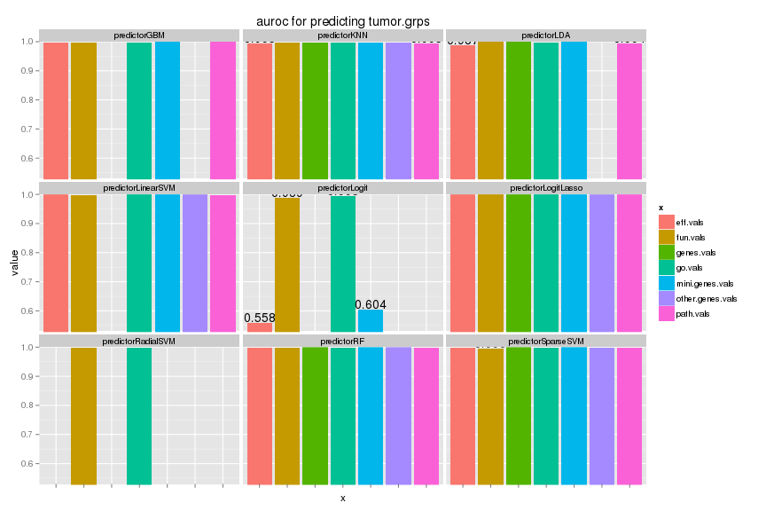

# Results
# Yunlong Jiao, 10 March 2016

This script collects results from earlier run and illustrates with tables and plots.


```r
knitr::opts_chunk$set(error = FALSE, warning = FALSE, message = FALSE, fig.width = 12, fig.height = 8, dev = c("png","pdf"), fig.keep = "high", fig.path = "result_figure/", cache.path = "result_cache/")
set.seed(70236562)
source("../../src/func.R")
library(ggplot2)
```

# Read in scores


```r
# read in score table
scores <- read.table("scores.txt", header = FALSE)
colnames(scores) <- c("x", "y", "predictor", "score", "value")
xlist <- unique(scores$x)
ylist <- unique(scores$y)
prlist <- unique(scores$predictor)
slist <- unique(scores$score)
# round values to 3 digits for ease of labeling
scores <- subset(scores, !is.na(scores$value))
scores$value <- round(scores$value, 3)
head(scores)
```

```
##          x          y    predictor score value
## 1 fun.vals basal.grps predictorGBM   acc 0.905
## 2 fun.vals basal.grps predictorGBM   fpr 0.013
## 3 fun.vals basal.grps predictorGBM   tpr 0.560
## 4 fun.vals basal.grps predictorGBM   ppv 0.909
## 5 fun.vals basal.grps predictorGBM  fval 0.684
## 7 fun.vals basal.grps predictorGBM auroc 0.943
```

# Overview

We show the score values for different each feature types (with variance of boxplots across different methods in boxplot).


```r
# plot each grps in a separate figure
for (yname in ylist) {
  d <- subset(scores, scores$y == yname)
  p1 <- ggplot(d, aes(x = x, y = value)) + 
    geom_boxplot(aes(fill = x), alpha = 0.8) + 
    facet_wrap(~score) + 
    coord_cartesian(ylim = c(0, 1)) + 
    ggtitle(paste0("predicting ", yname)) + 
    theme(axis.text.x = element_blank())
  plot(p1)
}
```


# AUROC

As we see that class sizes are unbalanced so that we focus on AUROC to evaluate performance.


```r
# focus only one type of scores
key <- "auroc"
# plot each grps in a separate figure
for (yname in ylist) {
  d <- subset(scores, scores$score == key & scores$y == yname)
  yrange <- c(min(d$value)*0.95, 1)
  p1 <- ggplot(d, aes(x = x, y = value)) + 
    geom_bar(aes(fill = x), stat = "identity", position = "dodge") + 
    geom_text(aes(label = value), vjust = -0.3, colour = "black", 
              position = position_dodge(0.9), size = 4) + 
    facet_wrap(~predictor) + 
    coord_cartesian(ylim = yrange) + 
    ggtitle(paste0(key, " for predicting ", yname)) + 
    theme(axis.text.x = element_blank())
  plot(p1)
}
```



# Session info


```r
sessionInfo()
```

```
## R version 3.2.3 (2015-12-10)
## Platform: x86_64-apple-darwin13.4.0 (64-bit)
## Running under: OS X 10.11.4 (El Capitan)
## 
## locale:
## [1] C/UTF-8/C/C/C/C
## 
## attached base packages:
## [1] stats     graphics  grDevices utils     datasets  base     
## 
## other attached packages:
## [1] ggplot2_2.1.0 knitr_1.12.3 
## 
## loaded via a namespace (and not attached):
##  [1] labeling_0.3     colorspace_1.2-6 scales_0.4.0     plyr_1.8.3      
##  [5] magrittr_1.5     formatR_1.2.1    tools_3.2.3      gtable_0.2.0    
##  [9] Rcpp_0.12.3      stringi_1.0-1    grid_3.2.3       methods_3.2.3   
## [13] digest_0.6.9     stringr_1.0.0    munsell_0.4.3    evaluate_0.8
```
