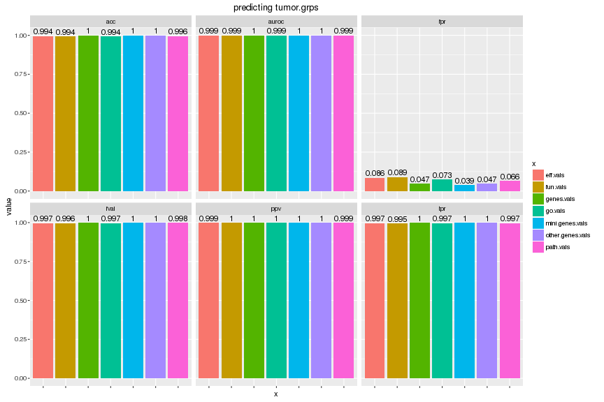

# Results
# Yunlong Jiao, 10 March 2016

This script collects results from earlier run and illustrates with tables and plots.


```r
knitr::opts_chunk$set(error = FALSE, warning = FALSE, message = FALSE, fig.width = 12, fig.height = 8, dev = c("png","pdf"), fig.keep = "high", fig.path = "result_figure/", cache.path = "result_cache/")
set.seed(70236562)
source("../../src/func.R")
library(ggplot2)
```

# Read in scores


```r
param <- read.table("cluster_param.txt", header = FALSE, row.names = NULL, col.names = c("idx", "xname", "yname", "prname", "rep", "nfolds", "nrepeats"))
xlist <- unique(param$xname)
ylist <- unique(param$yname)
prlist <- unique(param$prname)
nfolds <- unique(param$nfolds); stopifnot(length(nfolds) == 1)
nrepeats <- unique(param$nrepeats); stopifnot(length(nrepeats) == 1)
slist <- c("acc","fpr","tpr","ppv","fval","concordance.index","auroc")

scores <- list()
for (xname in xlist) {
  for (yname in ylist){
    for (prname in prlist) {
      message(".", appendLF = FALSE)
      objname <- paste('res', xname, yname, prname, nfolds, nrepeats, sep = '_')
      # read and combine cv results from cluster runs
      cvres.files <- list.files(path = "Robj", pattern = objname, full.names = TRUE)
      nfiles <- length(cvres.files) # number of cv jobs successfully done
      cvres <- lapply(cvres.files, function(f) get(load(f)))
      names(cvres) <- cvres.files
      assign(objname, crossValidationCombineResults(cvres))
      # plot ROC
      if (!dir.exists('figures')) dir.create('figures')
      plotROCcv(res = get(objname), savepath = paste0('figures/', objname, '.pdf'))
      # write in scores
      ss <- get(objname)[slist]
      ss[sapply(ss, is.null)] <- NA
      scores[[objname]] <- data.frame(x = xname, 
                                      y = yname, 
                                      predictor = prname, 
                                      score = slist, 
                                      value = unlist(ss), 
                                      n.cv.folds = nfiles,
                                      row.names = NULL)
    }
  }
}
scores <- do.call('rbind', scores)
rownames(scores) <- seq(nrow(scores))
# write out
write.table(scores, file = "scores.txt", row.names = TRUE, col.names = TRUE, sep = '\t')
# a bit more pruning for plotting
scores <- subset(scores, scores$score != "concordance.index")
scores$value <- round(scores$value, 3)
head(scores)
```

```
##          x          y    predictor score value n.cv.folds
## 1 eff.vals basal.grps predictorGBM   acc 0.941         50
## 2 eff.vals basal.grps predictorGBM   fpr 0.010         50
## 3 eff.vals basal.grps predictorGBM   tpr 0.733         50
## 4 eff.vals basal.grps predictorGBM   ppv 0.946         50
## 5 eff.vals basal.grps predictorGBM  fval 0.822         50
## 7 eff.vals basal.grps predictorGBM auroc 0.968         50
```

# Overview

We show the score values for different each feature types (with variance of boxplots across different methods in boxplot).


```r
# plot each grps in a separate figure
for (yname in ylist) {
  d <- subset(scores, scores$y == yname)
  p1 <- ggplot(d, aes(x = x, y = value)) + 
    geom_boxplot(aes(fill = x), alpha = 0.8) + 
    facet_wrap(~score) + 
    coord_cartesian(ylim = c(0, 1)) + 
    ggtitle(paste0("predicting ", yname)) + 
    theme(axis.text.x = element_blank())
  plot(p1)
}
```



# AUROC

As we see that class sizes are unbalanced so that we focus on AUROC to evaluate performance.


