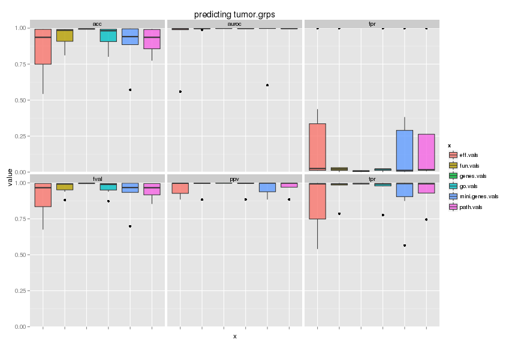
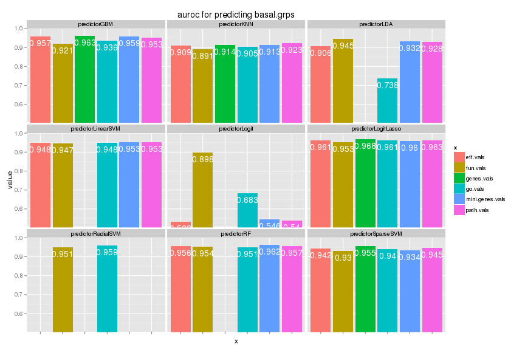
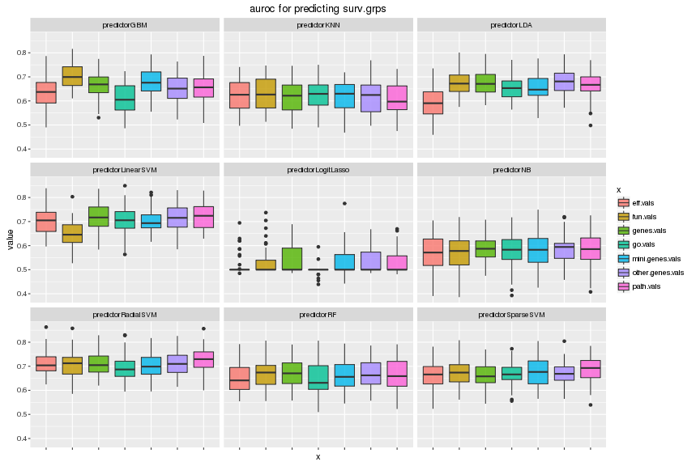

# Results
# Yunlong Jiao, 10 March 2016

This script collects results from earlier run and illustrates with tables and plots.


```r
knitr::opts_chunk$set(error = FALSE, warning = FALSE, fig.width = 12, fig.height = 8, dev = c("png","pdf"), fig.keep = "high", fig.path = "result_figure/", cache.path = "result_cache/")
source("../../src/func.R")
library(ggplot2)
```

```
## Loading required package: methods
```

# Read scores


```r
# read in score table
scores <- read.table("scores.txt", header = FALSE)
colnames(scores) <- c("x", "y", "predictor", "score", "value")
xlist <- unique(scores$x)
ylist <- unique(scores$y)
prlist <- unique(scores$predictor)
slist <- unique(scores$score)
# round values to 3 digits for ease of labeling
scores <- subset(scores, !is.na(scores$value))
scores$value <- round(scores$value, 3)
head(scores)
```

```
##          x          y    predictor score value
## 1 fun.vals basal.grps predictorKNN   acc 0.897
## 2 fun.vals basal.grps predictorKNN   fpr 0.535
## 3 fun.vals basal.grps predictorKNN   tpr 1.000
## 4 fun.vals basal.grps predictorKNN   ppv 0.888
## 5 fun.vals basal.grps predictorKNN  fval 0.940
## 7 fun.vals basal.grps predictorKNN auroc 0.891
```

# Overview

We plot the boxplot showing the score values for each feature type across different methods.


```r
# plot each grps in a separate figure
for (yname in ylist) {
  d <- subset(scores, scores$y == yname)
  p1 <- ggplot(d, aes(x = x, y = value)) + 
    geom_boxplot(aes(fill = x), alpha = 0.8) + 
    facet_wrap(~score) + 
    coord_cartesian(ylim = c(0, 1)) + 
    ggtitle(paste0("predicting ", yname)) + 
    theme(axis.text.x = element_blank())
  plot(p1)
}
```




# AUROC

As we see that error rate is not high but fpr is very high. We focus on AUROC to evaluate performance.


```r
# focus only one type of scores
key <- "auroc"
# plot each grps in a separate figure
for (yname in ylist) {
  d <- subset(scores, scores$score == key & scores$y == yname)
  yrange <- c(min(d$value)*0.95, 1)
  p1 <- ggplot(d, aes(x = x, y = value)) + 
    geom_bar(aes(fill = x), stat = "identity", position = "dodge") + 
    geom_text(aes(label = value), vjust = 1.6, colour = "white", 
              position = position_dodge(0.9), size = 5) + 
    facet_wrap(~predictor) + 
    coord_cartesian(ylim = yrange) + 
    ggtitle(paste0(key, " for predicting ", yname)) + 
    theme(axis.text.x = element_blank())
  plot(p1)
}
```

```
## ymax not defined: adjusting position using y instead
## ymax not defined: adjusting position using y instead
## ymax not defined: adjusting position using y instead
## ymax not defined: adjusting position using y instead
## ymax not defined: adjusting position using y instead
## ymax not defined: adjusting position using y instead
## ymax not defined: adjusting position using y instead
## ymax not defined: adjusting position using y instead
```



```
## ymax not defined: adjusting position using y instead
## ymax not defined: adjusting position using y instead
## ymax not defined: adjusting position using y instead
## ymax not defined: adjusting position using y instead
## ymax not defined: adjusting position using y instead
## ymax not defined: adjusting position using y instead
## ymax not defined: adjusting position using y instead
## ymax not defined: adjusting position using y instead
```



# Session info


```r
sessionInfo()
```

```
## R version 3.2.1 (2015-06-18)
## Platform: x86_64-unknown-linux-gnu (64-bit)
## 
## locale:
##  [1] LC_CTYPE=en_US.UTF-8       LC_NUMERIC=C              
##  [3] LC_TIME=en_US.UTF-8        LC_COLLATE=en_US.UTF-8    
##  [5] LC_MONETARY=en_US.UTF-8    LC_MESSAGES=en_US.UTF-8   
##  [7] LC_PAPER=en_US.UTF-8       LC_NAME=C                 
##  [9] LC_ADDRESS=C               LC_TELEPHONE=C            
## [11] LC_MEASUREMENT=en_US.UTF-8 LC_IDENTIFICATION=C       
## 
## attached base packages:
## [1] methods   stats     graphics  grDevices utils     datasets  base     
## 
## other attached packages:
## [1] ggplot2_1.0.1 knitr_1.12.3 
## 
## loaded via a namespace (and not attached):
##  [1] Rcpp_0.12.1      digest_0.6.8     MASS_7.3-44      grid_3.2.1      
##  [5] plyr_1.8.3       gtable_0.1.2     formatR_1.3      magrittr_1.5    
##  [9] evaluate_0.8.3   scales_0.3.0     stringi_1.0-1    reshape2_1.4.1  
## [13] labeling_0.3     proto_0.3-10     tools_3.2.1      stringr_1.0.0   
## [17] munsell_0.4.2    colorspace_1.2-6
```
