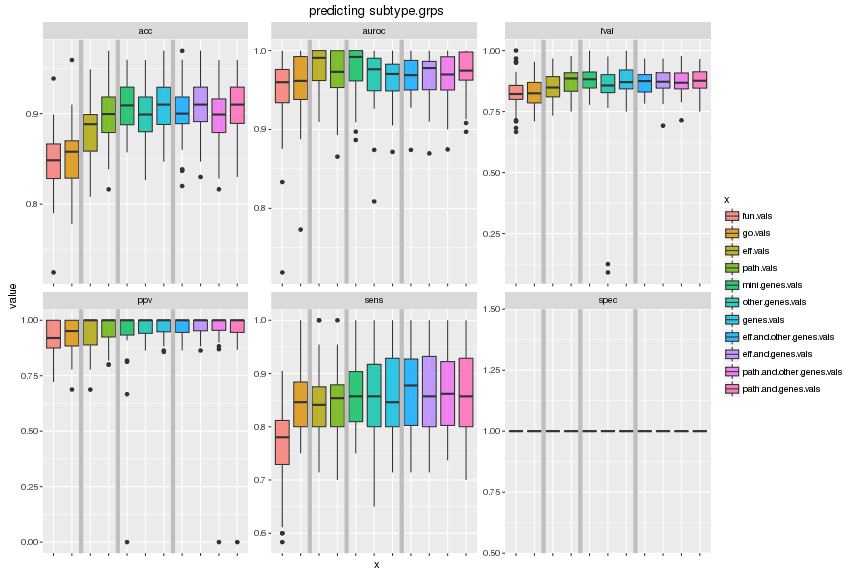
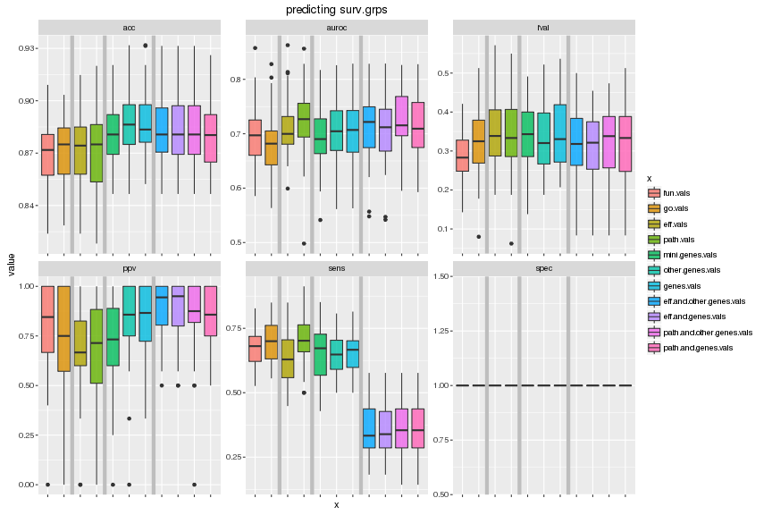
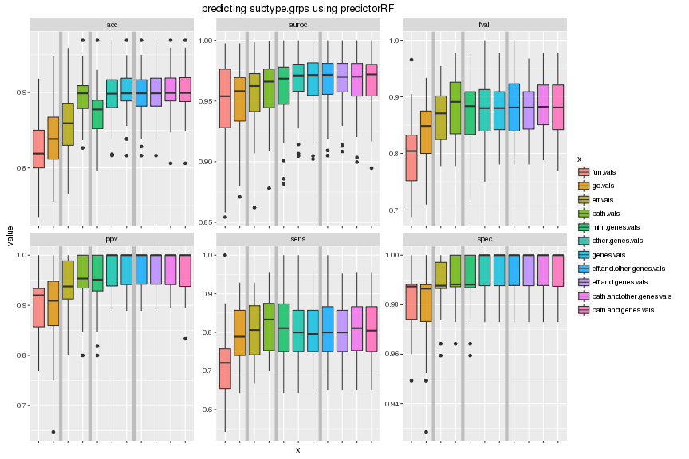
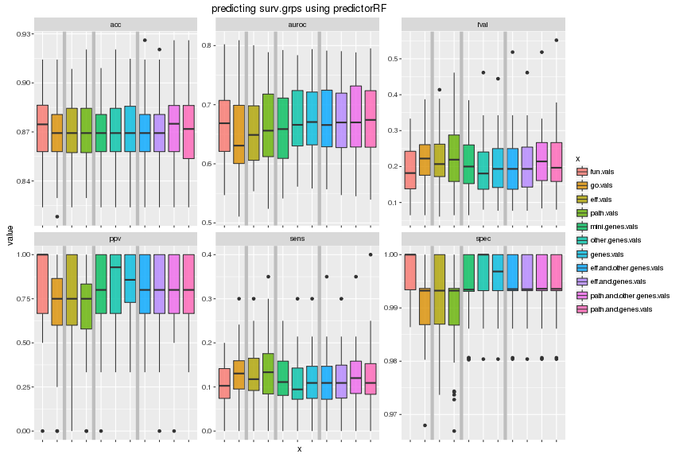

# Results
# Yunlong Jiao, 15 Apr 2016

This script collects results from earlier run and illustrates with tables and plots.


```r
knitr::opts_chunk$set(error = FALSE, fig.width = 12, fig.height = 8, dev = c("png","pdf"), fig.keep = "high", fig.path = "3_results_figure/", cache.path = "3_results_cache/")
set.seed(70236562)
source("../../src/func.R")
library(ggplot2)
library(reshape2)
```

First read in parameters!


```r
# read in parameters
param <- read.table("2_runPredict.txt", header = FALSE, row.names = NULL, col.names = c("xname", "yname", "prname", "i.fold", "nfolds", "nrepeats", "i.fold.inn", "nfolds.inn", "nrepeats.inn"))
# features
xlist <- unique(param$xname)
xlist
```

```
##  [1] "eff.vals"                  "fun.vals"                 
##  [3] "genes.vals"                "go.vals"                  
##  [5] "mini.genes.vals"           "other.genes.vals"         
##  [7] "path.vals"                 "eff.and.other.genes.vals" 
##  [9] "eff.and.genes.vals"        "path.and.other.genes.vals"
## [11] "path.and.genes.vals"
```

```r
# feature types
xlist.type <- c("func-wise", "func-wise", 
                "path-wise", "path-wise", 
                "gene-wise", "gene-wise", "gene-wise", 
                "mix-wise", "mix-wise", "mix-wise", "mix-wise")
names(xlist.type) <- c("fun.vals", "go.vals", # functionality features
                       "eff.vals", "path.vals", # pathway features
                       "mini.genes.vals", "other.genes.vals", "genes.vals", # gene features
                       "eff.and.other.genes.vals", "eff.and.genes.vals", "path.and.other.genes.vals", "path.and.genes.vals") # mixed type
xlist.vline <- c(2.5, 4.5, 7.5) # cut out types
stopifnot(length(setdiff(xlist, names(xlist.type))) == 0)
xlist.type
```

```
##                  fun.vals                   go.vals 
##               "func-wise"               "func-wise" 
##                  eff.vals                 path.vals 
##               "path-wise"               "path-wise" 
##           mini.genes.vals          other.genes.vals 
##               "gene-wise"               "gene-wise" 
##                genes.vals  eff.and.other.genes.vals 
##               "gene-wise"                "mix-wise" 
##        eff.and.genes.vals path.and.other.genes.vals 
##                "mix-wise"                "mix-wise" 
##       path.and.genes.vals 
##                "mix-wise"
```

```r
# groups
ylist <- unique(param$yname)
ylist
```

```
## [1] "subtype.grps" "surv.grps"
```

```r
# group scores
ylist.score <- c("auroc", "auroc", "auroc", 
                 "acc")
names(ylist.score) <- c("basal.grps", "tumor.grps", "surv.grps", # binary
                        "subtype.grps") # multi-class
stopifnot(length(setdiff(ylist, names(ylist.score))) == 0)
ylist.score
```

```
##   basal.grps   tumor.grps    surv.grps subtype.grps 
##      "auroc"      "auroc"      "auroc"        "acc"
```

```r
# predictors
prlist <- unique(param$prname)
prlist
```

```
##  [1] "predictorConstant"   "predictorGBM"        "predictorKendallSVM"
##  [4] "predictorKNN"        "predictorLDA"        "predictorLinearSVM" 
##  [7] "predictorLogitLasso" "predictorNB"         "predictorPAM"       
## [10] "predictorRadialSVM"  "predictorRF"         "predictorSparseSVM"
```

```r
# (outter) `nfolds`-fold CV repeated `nrepeats` times for evaluation
nfolds <- unique(param$nfolds)
stopifnot(length(nfolds) == 1)
nfolds
```

```
## [1] 5
```

```r
nrepeats <- unique(param$nrepeats)
stopifnot(length(nrepeats) == 1)
nrepeats
```

```
## [1] 10
```

```r
# inner `nfolds.inn`-fold CV repeated `nrepeats.inn` times for tuning predictors
nfolds.inn <- unique(param$nfolds.inn)
stopifnot(length(nfolds.inn) == 1)
nfolds.inn
```

```
## [1] 5
```

```r
nrepeats.inn <- unique(param$nrepeats.inn)
stopifnot(length(nrepeats.inn) == 1)
nrepeats.inn
```

```
## [1] 1
```

```r
# evaluation measures
slist <- c("acc","fpr","tpr","ppv","fval","auroc")
slist
```

```
## [1] "acc"   "fpr"   "tpr"   "ppv"   "fval"  "auroc"
```

```r
slist.prefer.large.score <- c(TRUE, FALSE, TRUE, TRUE, TRUE, TRUE)
names(slist.prefer.large.score) <- slist
slist.prefer.large.score
```

```
##   acc   fpr   tpr   ppv  fval auroc 
##  TRUE FALSE  TRUE  TRUE  TRUE  TRUE
```

## Tuning predictor

In order to avoid overfitting with the choice of prediction algorithm used, across each feature `xname` X each label group `yname` X each evaluation CV (outter) fold repeat `i.fold`, the predictor `prname` is selected by nested CV (inner) runs and the best prediction performance is reported by each evaluation measure.


```r
# gather scores
scores <- list()
for (i.fold in seq(nfolds*nrepeats)) {
  message("\n", i.fold, "-th fold out of ", nfolds*nrepeats, " folds ", appendLF = FALSE)
  for (yname in ylist) {
    for (xname in xlist) {
      message(".", appendLF = FALSE)
      # get obj
      objname <- paste('res', xname, yname, i.fold, nfolds, nrepeats, sep = '_')
      objpath <- paste0('Robj/',objname,'.RData')
      if (file.exists(objpath)) {
        ivres <- get(load(objpath))
      } else {
        # read nested cv res
        cvres <- list()
        for (prname in prlist) {
          res.files <- list.files(path = 'Robj', 
                                  pattern = paste('^cvres', xname, yname, prname, 
                                                  i.fold, nfolds, nrepeats, 
                                                  '[[:digit:]]+', nfolds.inn, nrepeats.inn, 
                                                  sep = '_'), 
                                  full.names = TRUE)
          res <- lapply(res.files, function(f) try(get(load(f))))
          res <- res[sapply(res, function(x) !inherits(x, "try-error"))]
          cvres[[prname]] <- crossValidationCombineResults(res)
        }
        
        # generate iv res where predictor has been selected by nested cv
        ivres <- list()
        for (sname in slist) {
          tt <- sapply(cvres, '[[', "system_time")
          # order scores by increasing system time
          ss <- sapply(cvres, '[[', sname)[order(tt, decreasing = FALSE)]
          ss <- ss[!is.na(ss)]
          # fast algorithm is preferred among those returning equal score values
          best.prname <- names(ss)[order(ss, decreasing = slist.prefer.large.score[sname])]
          # get iv res NOTE while loop is to guarantee no iv res is found for such predictor
          while (length(best.prname) > 0) {
            best.files <- list.files(path = 'Robj', 
                                     pattern = paste('^ivres', xname, yname, best.prname[1], 
                                                     i.fold, nfolds, nrepeats, 
                                                     '0+', nfolds.inn, nrepeats.inn, 
                                                     sep = '_'), 
                                     full.names = TRUE)
            if (length(best.files) == 0) {
              best.prname <- best.prname[-1]
              next
            } else if (length(best.files) == 1) {
              best.prname <- best.prname[1]
              ivres[[sname]] <- get(load(best.files))
              break
            } else {
              stop("multiple ivres files found for ", best.prname[1])
            }
          }
          # in case no ivres files found for any predictors
          stopifnot(length(best.prname) == 1)
        }
        
        # save up
        assign(objname, ivres)
        save(list = objname, file = objpath)
        rm(list = c(objname,"cvres"))
        gc()
      }
      
      # record score values
      scores[[objname]] <- data.frame(y = yname, 
                                      x = xname, 
                                      type = xlist.type[xname], 
                                      predictor = sapply(slist, function(sname) ivres[[sname]][["predictor"]]), 
                                      rep = i.fold, 
                                      score = slist, 
                                      value = sapply(slist, function(sname) ivres[[sname]][[sname]]), 
                                      row.names = NULL)
      rm(ivres)
      gc()
    }
  }
}
scores <- do.call('rbind', scores)
rownames(scores) <- seq(nrow(scores))
# write out scores
write.table(scores, file = "scores.txt", row.names = TRUE, col.names = TRUE, sep = '\t')
# preview
head(scores)
```

```
##              y        x      type           predictor rep score     value
## 1 subtype.grps eff.vals path-wise  predictorLinearSVM   1   acc 0.8888889
## 2 subtype.grps eff.vals path-wise   predictorConstant   1   fpr 0.0000000
## 3 subtype.grps eff.vals path-wise        predictorPAM   1   tpr 0.8500000
## 4 subtype.grps eff.vals path-wise  predictorLinearSVM   1   ppv 0.9444444
## 5 subtype.grps eff.vals path-wise predictorKendallSVM   1  fval 0.8947368
## 6 subtype.grps eff.vals path-wise        predictorKNN   1 auroc 0.9615385
```

## Performance overview

In this section, each plot corresponds to the prediction performance for one specific group of phenotypic response. In each plot, along x-axis we have different feature matrices, along y-axis we have different evaluation measures, the barplot shows the CV scores evaluated against randomly splitted CV folds.

Notes that some evaluation measures (`acc`, `ppv`, etc) do associate with a specific `cutoff` threshold for predicted probability, which is always set to constant 0.5. It might be interesting to tune the threshold in case that the class sizes in training data are unbalanced.

The evaluation measure are the following: acc, fpr, tpr, ppv, fval, auroc. Note that in order to remove confusion, we equivalently rename `TPR` by `Sensitivity`, and plot `Specificity = 1 - FPR` instead of `FPR` values. As a result, for any evaluation measure present in the plot, higher values indicate better performance unanimously.


```r
scores <- read.table("scores.txt", header = TRUE, row.names = 1, col.names = c("y", "x", "type", "predictor", "rep", "score", "value"), sep = '\t')
# plot each grps in a separate figure
for (yname in ylist) {
  d <- subset(scores, scores$y == yname)
  # order feature by types
  d$x <- factor(d$x, levels = names(xlist.type), ordered = TRUE)
  # change score values by "fpr" to that by "spec"
  d$value[d$score == "fpr"] <- 1 - d$value[d$score == "fpr"]
  d$score[d$score == "fpr"] <- "spec"
  # change score name "tpr" to "sens"
  d$score[d$score == "tpr"] <- "sens"
  p1 <- ggplot(d, aes(x = x, y = value)) + 
    geom_boxplot(aes(fill = x), alpha = 0.8) + 
    geom_vline(xintercept = xlist.vline, color = "grey", size = 2) + 
    facet_wrap(~score, scales = "free") + 
    ggtitle(paste0("predicting ", yname)) + 
    theme(axis.text.x = element_blank())
  plot(p1)
}
```

```
## Warning: Removed 7 rows containing non-finite values (stat_boxplot).
```



```
## Warning: Removed 194 rows containing non-finite values (stat_boxplot).
```



## Predictor table

As defined in `ylist.score`: **for binary classes,** as we see that class sizes are unbalanced so that we focus on `auroc` to evaluate performance. This way we also get rid of the effect from tuning cutoff parameter; **for multiple classes,** we focus on multi-class classification accuracy `acc` to evaluate performance.

Now we turn to look at which `predictor` suits well in making prediction for a specific group of phenotypic response `yname` using each feature `xname`. We report the frequency of such predictor is selected across 50 repeats of evaluation CV runs.


```r
# show each grp separately
for (yname in ylist) {
  sname <- ylist.score[yname]
  cat('\n---> \t Frequency (%) of predictor being selected \t <---\n')
  cat('\n---> \t predicting for ', yname, ' using \t <---\n')
  d <- subset(scores, scores$score == sname & scores$y == yname)
  d <- split(d, d$x)
  freq.best.prname <- lapply(d, function(u){
    s <- sort(table(u$predictor)/length(u$predictor)*100, decreasing = TRUE)
    formatC(s, format = 'f', digits = 2)
  })
  print(freq.best.prname)
}
```

```
## 
## ---> 	 Frequency (%) of predictor being selected 	 <---
## 
## ---> 	 predicting for  subtype.grps  using 	 <---
## $eff.and.genes.vals
## 
##        predictorGBM predictorLogitLasso  predictorSparseSVM 
##             "84.00"              "8.00"              "8.00" 
## 
## $eff.and.other.genes.vals
## 
##        predictorGBM predictorLogitLasso  predictorSparseSVM 
##             "66.00"             "20.00"             "12.00" 
##         predictorRF 
##              "2.00" 
## 
## $eff.vals
## 
##        predictorGBM predictorLogitLasso  predictorLinearSVM 
##             "74.00"             "20.00"              "4.00" 
##  predictorSparseSVM 
##              "2.00" 
## 
## $fun.vals
## 
##  predictorLinearSVM  predictorRadialSVM        predictorLDA 
##             "66.00"             "28.00"              "4.00" 
## predictorKendallSVM 
##              "2.00" 
## 
## $genes.vals
## 
##        predictorGBM predictorLogitLasso  predictorSparseSVM 
##             "72.00"             "16.00"             "12.00" 
## 
## $go.vals
## 
## predictorKendallSVM predictorLogitLasso  predictorRadialSVM 
##             "44.00"             "26.00"             "18.00" 
##  predictorLinearSVM        predictorGBM 
##              "8.00"              "4.00" 
## 
## $mini.genes.vals
## 
##        predictorGBM predictorLogitLasso 
##             "94.00"              "6.00" 
## 
## $other.genes.vals
## 
##        predictorGBM predictorLogitLasso  predictorSparseSVM 
##             "62.00"             "22.00"             "14.00" 
##         predictorRF 
##              "2.00" 
## 
## $path.and.genes.vals
## 
##        predictorGBM  predictorSparseSVM predictorLogitLasso 
##             "80.00"              "8.00"              "6.00" 
##         predictorRF 
##              "6.00" 
## 
## $path.and.other.genes.vals
## 
##        predictorGBM predictorLogitLasso         predictorRF 
##             "56.00"             "24.00"             "10.00" 
##  predictorSparseSVM 
##             "10.00" 
## 
## $path.vals
## 
##        predictorGBM predictorLogitLasso         predictorRF 
##             "62.00"             "28.00"             "10.00" 
## 
## 
## ---> 	 Frequency (%) of predictor being selected 	 <---
## 
## ---> 	 predicting for  surv.grps  using 	 <---
## $eff.and.genes.vals
## 
## predictorLinearSVM predictorRadialSVM       predictorGBM 
##            "64.00"            "26.00"             "4.00" 
##       predictorLDA        predictorRF 
##             "4.00"             "2.00" 
## 
## $eff.and.other.genes.vals
## 
## predictorLinearSVM predictorRadialSVM       predictorLDA 
##            "68.00"            "24.00"             "4.00" 
##       predictorGBM        predictorRF 
##             "2.00"             "2.00" 
## 
## $eff.vals
## 
## predictorRadialSVM predictorLinearSVM predictorSparseSVM 
##            "86.00"            "10.00"             "4.00" 
## 
## $fun.vals
## 
##  predictorRadialSVM        predictorGBM predictorKendallSVM 
##             "72.00"             "20.00"              "4.00" 
##        predictorLDA  predictorSparseSVM 
##              "2.00"              "2.00" 
## 
## $genes.vals
## 
## predictorLinearSVM predictorRadialSVM       predictorLDA 
##            "60.00"            "32.00"             "4.00" 
##        predictorRF 
##             "4.00" 
## 
## $go.vals
## 
##  predictorRadialSVM  predictorLinearSVM  predictorSparseSVM 
##             "50.00"             "38.00"              "8.00" 
## predictorKendallSVM        predictorLDA 
##              "2.00"              "2.00" 
## 
## $mini.genes.vals
## 
##  predictorRadialSVM  predictorLinearSVM        predictorGBM 
##             "52.00"             "42.00"              "2.00" 
## predictorKendallSVM         predictorRF 
##              "2.00"              "2.00" 
## 
## $other.genes.vals
## 
##  predictorLinearSVM  predictorRadialSVM        predictorLDA 
##             "60.00"             "30.00"              "4.00" 
##         predictorRF predictorKendallSVM 
##              "4.00"              "2.00" 
## 
## $path.and.genes.vals
## 
## predictorLinearSVM predictorRadialSVM       predictorLDA 
##            "50.00"            "34.00"            "14.00" 
##       predictorGBM 
##             "2.00" 
## 
## $path.and.other.genes.vals
## 
## predictorLinearSVM predictorRadialSVM 
##            "64.00"            "36.00" 
## 
## $path.vals
## 
## predictorRadialSVM predictorLinearSVM predictorSparseSVM 
##            "62.00"            "32.00"             "4.00" 
##       predictorLDA 
##             "2.00"
```

## Significance test

Now we look at the significance of the superiority using one feature over the other in terms of performance. For each group of phenotypic response `yname`, we compute a matrix where each entry indicates the p-value of a one-sided `t.test` testing if using the feature matrix in the row is indeed superior to using the feature matrix in the col.


```r
# significance threshold
thres <- 0.05
# show each grp separately
for (yname in ylist) {
  sname <- ylist.score[yname]
  cat('\n---> \t p-value of t.test showing row superior to col \t <---\n')
  cat('\n------> \t predicting for ', yname, ' \t <------\n')
  # gather perf
  d <- subset(scores, scores$score == sname & scores$y == yname)
  d <- lapply(split(d, d$x), "[[", "value")
  # order xlist
  xlist.ordered <- as.character(sort(factor(xlist, levels = names(xlist.type), ordered = TRUE)))
  pmatrix <- matrix(-100, nrow = length(xlist), ncol = length(xlist), 
                    dimnames = list(xlist.ordered, xlist.ordered))
  # test now
  for (i in xlist.ordered) {
    for (j in xlist.ordered) {
      tt <- t.test(x = d[[i]], y = d[[j]], alternative = 'greater', mu = 0, paired = TRUE)
      pmatrix[i,j] <- round(tt$p.value, 4)
    }
  }
  # correct p-value for multiple testing with Benjamini-Hochberg
  pmatrix.adj <- p.adjust(pmatrix, "BH")
  attributes(pmatrix.adj) <- attributes(pmatrix)
  print(pmatrix.adj)
  cat('\nSimplify by thresholding at p-value <', thres, '\n')
  print(pmatrix.adj < thres)
}
```

```
## 
## ---> 	 p-value of t.test showing row superior to col 	 <---
## 
## ------> 	 predicting for  subtype.grps  	 <------
##                            fun.vals go.vals eff.vals    path.vals
## fun.vals                        NaN       1        1 1.0000000000
## go.vals                   0.3122128     NaN        1 1.0000000000
## eff.vals                  0.0000000       0      NaN 1.0000000000
## path.vals                 0.0000000       0        0          NaN
## mini.genes.vals           0.0000000       0        0 0.0003666667
## other.genes.vals          0.0000000       0        0 0.7330566038
## genes.vals                0.0000000       0        0 0.0098717949
## eff.and.other.genes.vals  0.0000000       0        0 0.1466666667
## eff.and.genes.vals        0.0000000       0        0 0.0025142857
## path.and.other.genes.vals 0.0000000       0        0 0.6412352941
## path.and.genes.vals       0.0000000       0        0 0.0072368421
##                           mini.genes.vals other.genes.vals genes.vals
## fun.vals                                1     1.0000000000  1.0000000
## go.vals                                 1     1.0000000000  1.0000000
## eff.vals                                1     1.0000000000  1.0000000
## path.vals                               1     1.0000000000  1.0000000
## mini.genes.vals                       NaN     0.0000000000  0.3077609
## other.genes.vals                        1              NaN  1.0000000
## genes.vals                              1     0.0010312500        NaN
## eff.and.other.genes.vals                1     0.0749534884  1.0000000
## eff.and.genes.vals                      1     0.0003666667  0.4534694
## path.and.other.genes.vals               1     0.8510000000  1.0000000
## path.and.genes.vals                     1     0.0033611111  0.8333519
##                           eff.and.other.genes.vals eff.and.genes.vals
## fun.vals                               1.000000000             1.0000
## go.vals                                1.000000000             1.0000
## eff.vals                               1.000000000             1.0000
## path.vals                              1.000000000             1.0000
## mini.genes.vals                        0.009900000             0.5808
## other.genes.vals                       1.000000000             1.0000
## genes.vals                             0.038634146             1.0000
## eff.and.other.genes.vals                       NaN             1.0000
## eff.and.genes.vals                     0.004162162                NaN
## path.and.other.genes.vals              1.000000000             1.0000
## path.and.genes.vals                    0.045571429             1.0000
##                           path.and.other.genes.vals path.and.genes.vals
## fun.vals                                1.000000000           1.0000000
## go.vals                                 1.000000000           1.0000000
## eff.vals                                1.000000000           1.0000000
## path.vals                               1.000000000           1.0000000
## mini.genes.vals                         0.001031250           0.4379375
## other.genes.vals                        1.000000000           1.0000000
## genes.vals                              0.001294118           1.0000000
## eff.and.other.genes.vals                0.087000000           1.0000000
## eff.and.genes.vals                      0.000000000           0.7249423
## path.and.other.genes.vals                       NaN           1.0000000
## path.and.genes.vals                     0.001294118                 NaN
## 
## Simplify by thresholding at p-value < 0.05 
##                           fun.vals go.vals eff.vals path.vals
## fun.vals                        NA   FALSE    FALSE     FALSE
## go.vals                      FALSE      NA    FALSE     FALSE
## eff.vals                      TRUE    TRUE       NA     FALSE
## path.vals                     TRUE    TRUE     TRUE        NA
## mini.genes.vals               TRUE    TRUE     TRUE      TRUE
## other.genes.vals              TRUE    TRUE     TRUE     FALSE
## genes.vals                    TRUE    TRUE     TRUE      TRUE
## eff.and.other.genes.vals      TRUE    TRUE     TRUE     FALSE
## eff.and.genes.vals            TRUE    TRUE     TRUE      TRUE
## path.and.other.genes.vals     TRUE    TRUE     TRUE     FALSE
## path.and.genes.vals           TRUE    TRUE     TRUE      TRUE
##                           mini.genes.vals other.genes.vals genes.vals
## fun.vals                            FALSE            FALSE      FALSE
## go.vals                             FALSE            FALSE      FALSE
## eff.vals                            FALSE            FALSE      FALSE
## path.vals                           FALSE            FALSE      FALSE
## mini.genes.vals                        NA             TRUE      FALSE
## other.genes.vals                    FALSE               NA      FALSE
## genes.vals                          FALSE             TRUE         NA
## eff.and.other.genes.vals            FALSE            FALSE      FALSE
## eff.and.genes.vals                  FALSE             TRUE      FALSE
## path.and.other.genes.vals           FALSE            FALSE      FALSE
## path.and.genes.vals                 FALSE             TRUE      FALSE
##                           eff.and.other.genes.vals eff.and.genes.vals
## fun.vals                                     FALSE              FALSE
## go.vals                                      FALSE              FALSE
## eff.vals                                     FALSE              FALSE
## path.vals                                    FALSE              FALSE
## mini.genes.vals                               TRUE              FALSE
## other.genes.vals                             FALSE              FALSE
## genes.vals                                    TRUE              FALSE
## eff.and.other.genes.vals                        NA              FALSE
## eff.and.genes.vals                            TRUE                 NA
## path.and.other.genes.vals                    FALSE              FALSE
## path.and.genes.vals                           TRUE              FALSE
##                           path.and.other.genes.vals path.and.genes.vals
## fun.vals                                      FALSE               FALSE
## go.vals                                       FALSE               FALSE
## eff.vals                                      FALSE               FALSE
## path.vals                                     FALSE               FALSE
## mini.genes.vals                                TRUE               FALSE
## other.genes.vals                              FALSE               FALSE
## genes.vals                                     TRUE               FALSE
## eff.and.other.genes.vals                      FALSE               FALSE
## eff.and.genes.vals                             TRUE               FALSE
## path.and.other.genes.vals                        NA               FALSE
## path.and.genes.vals                            TRUE                  NA
## 
## ---> 	 p-value of t.test showing row superior to col 	 <---
## 
## ------> 	 predicting for  surv.grps  	 <------
##                             fun.vals     go.vals   eff.vals path.vals
## fun.vals                         NaN 0.168093750 1.00000000 1.0000000
## go.vals                   1.00000000         NaN 1.00000000 1.0000000
## eff.vals                  0.14451724 0.003666667        NaN 1.0000000
## path.vals                 0.01466667 0.000000000 0.08878571       NaN
## mini.genes.vals           1.00000000 0.180333333 1.00000000 1.0000000
## other.genes.vals          0.21847222 0.015125000 1.00000000 1.0000000
## genes.vals                0.21847222 0.014666667 1.00000000 1.0000000
## eff.and.other.genes.vals  0.08878571 0.006000000 0.66795745 1.0000000
## eff.and.genes.vals        0.24623077 0.020166667 1.00000000 1.0000000
## path.and.other.genes.vals 0.00220000 0.000000000 0.02663158 0.6679574
## path.and.genes.vals       0.06811538 0.002200000 0.56540000 1.0000000
##                           mini.genes.vals other.genes.vals  genes.vals
## fun.vals                       0.86831250        1.0000000 1.000000000
## go.vals                        1.00000000        1.0000000 1.000000000
## eff.vals                       0.02985714        0.9350000 0.935000000
## path.vals                      0.00600000        0.1596774 0.156200000
## mini.genes.vals                       NaN        1.0000000 1.000000000
## other.genes.vals               0.03000000              NaN 0.948200000
## genes.vals                     0.02970000        1.0000000         NaN
## eff.and.other.genes.vals       0.00600000        0.2462308 0.231297297
## eff.and.genes.vals             0.04926087        0.9482000 0.948200000
## path.and.other.genes.vals      0.00000000        0.0055000 0.004714286
## path.and.genes.vals            0.01008333        0.3055854 0.299475000
##                           eff.and.other.genes.vals eff.and.genes.vals
## fun.vals                                1.00000000         1.00000000
## go.vals                                 1.00000000         1.00000000
## eff.vals                                1.00000000         0.94820000
## path.vals                               0.38550000         0.20317647
## mini.genes.vals                         1.00000000         1.00000000
## other.genes.vals                        1.00000000         1.00000000
## genes.vals                              1.00000000         1.00000000
## eff.and.other.genes.vals                       NaN         0.05896000
## eff.and.genes.vals                      1.00000000                NaN
## path.and.other.genes.vals               0.05408333         0.01682353
## path.and.genes.vals                     0.94820000         0.36018605
##                           path.and.other.genes.vals path.and.genes.vals
## fun.vals                                          1          1.00000000
## go.vals                                           1          1.00000000
## eff.vals                                          1          1.00000000
## path.vals                                         1          0.36018605
## mini.genes.vals                                   1          1.00000000
## other.genes.vals                                  1          1.00000000
## genes.vals                                        1          1.00000000
## eff.and.other.genes.vals                          1          1.00000000
## eff.and.genes.vals                                1          1.00000000
## path.and.other.genes.vals                       NaN          0.01466667
## path.and.genes.vals                               1                 NaN
## 
## Simplify by thresholding at p-value < 0.05 
##                           fun.vals go.vals eff.vals path.vals
## fun.vals                        NA   FALSE    FALSE     FALSE
## go.vals                      FALSE      NA    FALSE     FALSE
## eff.vals                     FALSE    TRUE       NA     FALSE
## path.vals                     TRUE    TRUE    FALSE        NA
## mini.genes.vals              FALSE   FALSE    FALSE     FALSE
## other.genes.vals             FALSE    TRUE    FALSE     FALSE
## genes.vals                   FALSE    TRUE    FALSE     FALSE
## eff.and.other.genes.vals     FALSE    TRUE    FALSE     FALSE
## eff.and.genes.vals           FALSE    TRUE    FALSE     FALSE
## path.and.other.genes.vals     TRUE    TRUE     TRUE     FALSE
## path.and.genes.vals          FALSE    TRUE    FALSE     FALSE
##                           mini.genes.vals other.genes.vals genes.vals
## fun.vals                            FALSE            FALSE      FALSE
## go.vals                             FALSE            FALSE      FALSE
## eff.vals                             TRUE            FALSE      FALSE
## path.vals                            TRUE            FALSE      FALSE
## mini.genes.vals                        NA            FALSE      FALSE
## other.genes.vals                     TRUE               NA      FALSE
## genes.vals                           TRUE            FALSE         NA
## eff.and.other.genes.vals             TRUE            FALSE      FALSE
## eff.and.genes.vals                   TRUE            FALSE      FALSE
## path.and.other.genes.vals            TRUE             TRUE       TRUE
## path.and.genes.vals                  TRUE            FALSE      FALSE
##                           eff.and.other.genes.vals eff.and.genes.vals
## fun.vals                                     FALSE              FALSE
## go.vals                                      FALSE              FALSE
## eff.vals                                     FALSE              FALSE
## path.vals                                    FALSE              FALSE
## mini.genes.vals                              FALSE              FALSE
## other.genes.vals                             FALSE              FALSE
## genes.vals                                   FALSE              FALSE
## eff.and.other.genes.vals                        NA              FALSE
## eff.and.genes.vals                           FALSE                 NA
## path.and.other.genes.vals                    FALSE               TRUE
## path.and.genes.vals                          FALSE              FALSE
##                           path.and.other.genes.vals path.and.genes.vals
## fun.vals                                      FALSE               FALSE
## go.vals                                       FALSE               FALSE
## eff.vals                                      FALSE               FALSE
## path.vals                                     FALSE               FALSE
## mini.genes.vals                               FALSE               FALSE
## other.genes.vals                              FALSE               FALSE
## genes.vals                                    FALSE               FALSE
## eff.and.other.genes.vals                      FALSE               FALSE
## eff.and.genes.vals                            FALSE               FALSE
## path.and.other.genes.vals                        NA                TRUE
## path.and.genes.vals                           FALSE                  NA
```

## Complementary section: performance with random forest only

This section is complementary to previous section "Performance overview". The difference is that here we do not tune predictor out but fix the predictor to be random forest. Then we compare performance of different feature types wrt various criteria. Generally RF should do a fairly good job in classification while enabling simultaneously feature selection.


```r
prname <- "predictorRF"
scores <- list()
for (yname in ylist) {
  for (xname in xlist) {
    message(yname, '\t', xname)
    res.files <- list.files(path = 'Robj', 
                            pattern = paste('^ivres', xname, yname, prname, 
                                            '[[:digit:]]+', nfolds, nrepeats, 
                                            0, nfolds.inn, nrepeats.inn, 
                                            sep = '_'), 
                            full.names = TRUE)
    res <- lapply(res.files, function(f) get(load(f)))
    names(res) <- paste0("rep",1:length(res))
    # reduce to only scores and melt
    res <- lapply(res, '[', slist)
    res <- melt(res)
    colnames(res)[colnames(res) == "L1"] <- "rep"
    colnames(res)[colnames(res) == "L2"] <- "score"
    
    # record score values
    objname <- paste('res', xname, yname, prname, nfolds, nrepeats, sep = '_')
    scores[[objname]] <- data.frame(y = yname, 
                                    x = xname, 
                                    type = xlist.type[xname], 
                                    predictor = prname, 
                                    res, 
                                    row.names = NULL)
  }
}
scores <- do.call('rbind', scores)
rownames(scores) <- seq(nrow(scores))
head(scores)
```

```
##              y        x      type   predictor      value score  rep
## 1 subtype.grps eff.vals path-wise predictorRF 0.86868687   acc rep1
## 2 subtype.grps eff.vals path-wise predictorRF 0.01265823   fpr rep1
## 3 subtype.grps eff.vals path-wise predictorRF 0.85000000   tpr rep1
## 4 subtype.grps eff.vals path-wise predictorRF 0.94444444   ppv rep1
## 5 subtype.grps eff.vals path-wise predictorRF 0.89473684  fval rep1
## 6 subtype.grps eff.vals path-wise predictorRF 0.97246835 auroc rep1
```


```r
# plot each grps in a separate figure
for (yname in ylist) {
  d <- subset(scores, scores$y == yname)
  # order feature by types
  d$x <- factor(d$x, levels = names(xlist.type), ordered = TRUE)
  # change score values by "fpr" to that by "spec"
  d$value[d$score == "fpr"] <- 1 - d$value[d$score == "fpr"]
  d$score[d$score == "fpr"] <- "spec"
  # change score name "tpr" to "sens"
  d$score[d$score == "tpr"] <- "sens"
  p1 <- ggplot(d, aes(x = x, y = value)) + 
    geom_boxplot(aes(fill = x), alpha = 0.8) + 
    geom_vline(xintercept = xlist.vline, color = "grey", size = 2) + 
    facet_wrap(~score, scales = "free") + 
    ggtitle(paste0("predicting ", yname, " using ", prname)) + 
    theme(axis.text.x = element_blank())
  plot(p1)
}
```



```
## Warning: Removed 35 rows containing non-finite values (stat_boxplot).
```



## Session info


