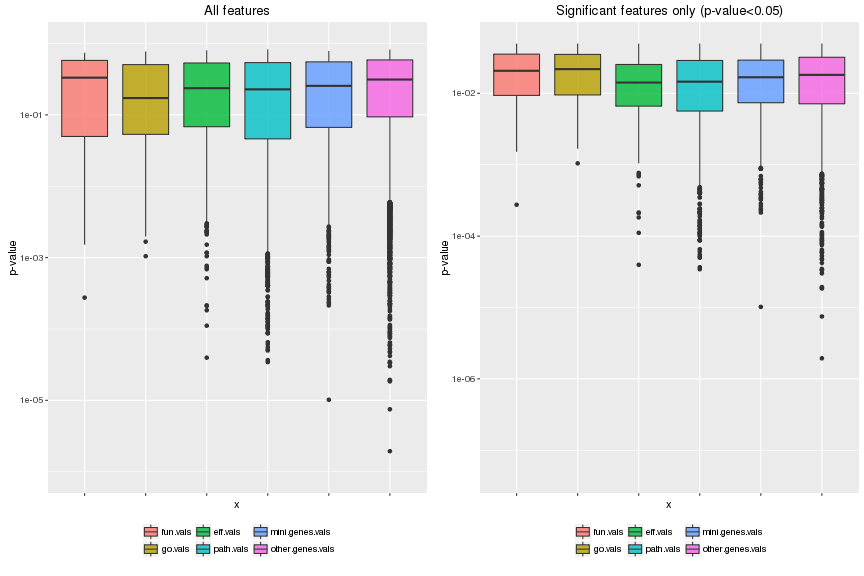
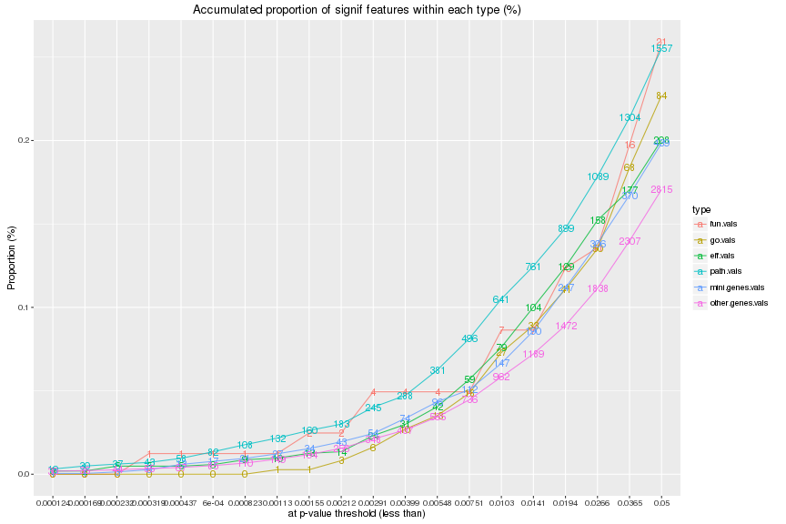
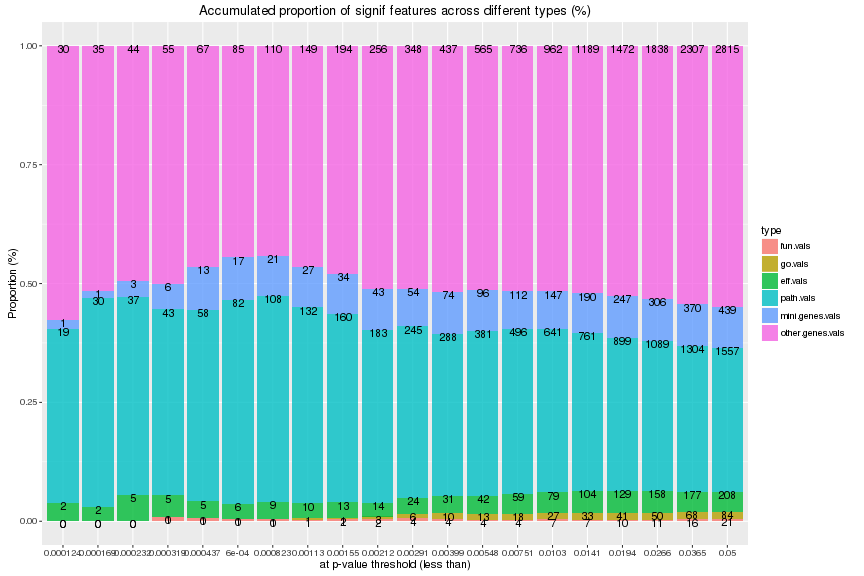
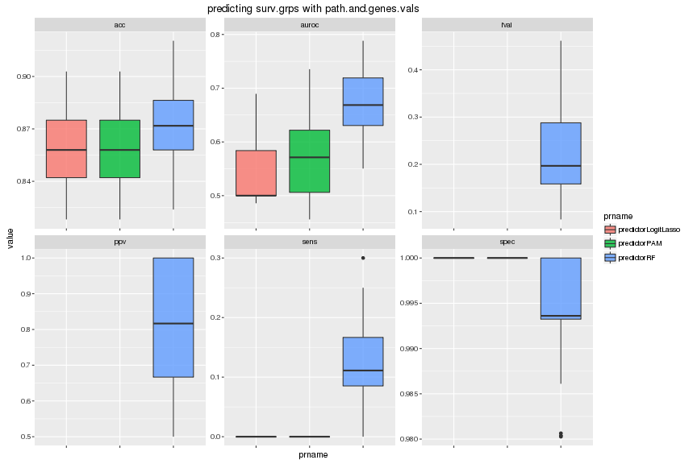
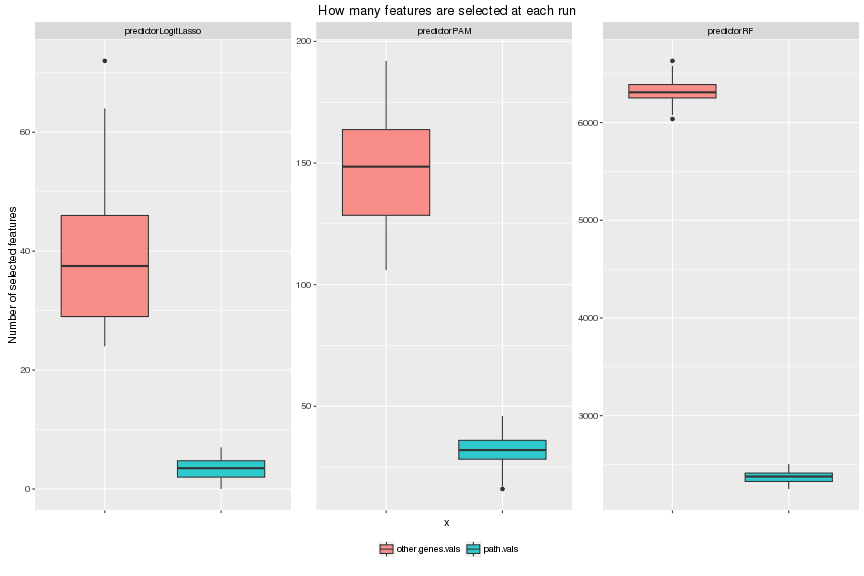
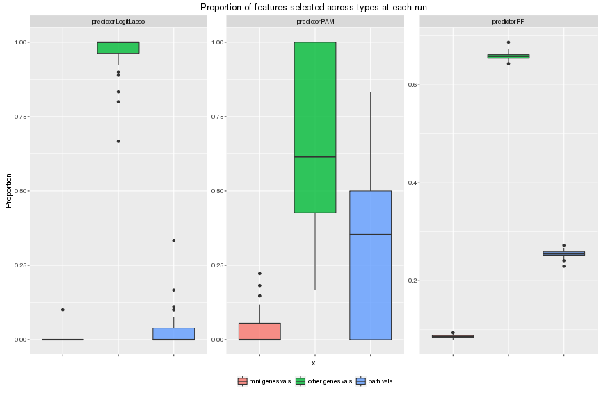
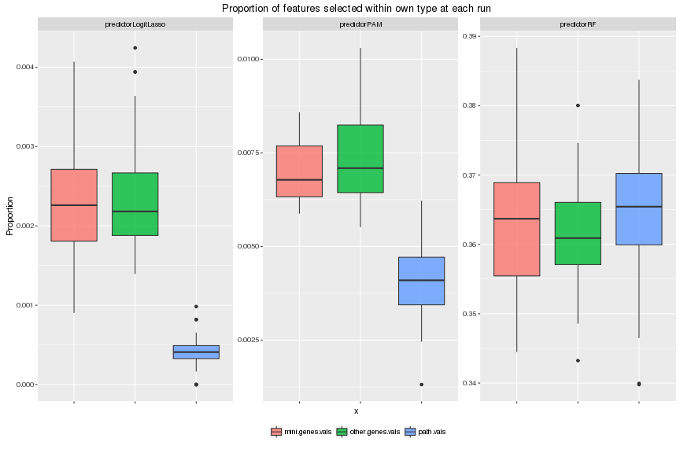
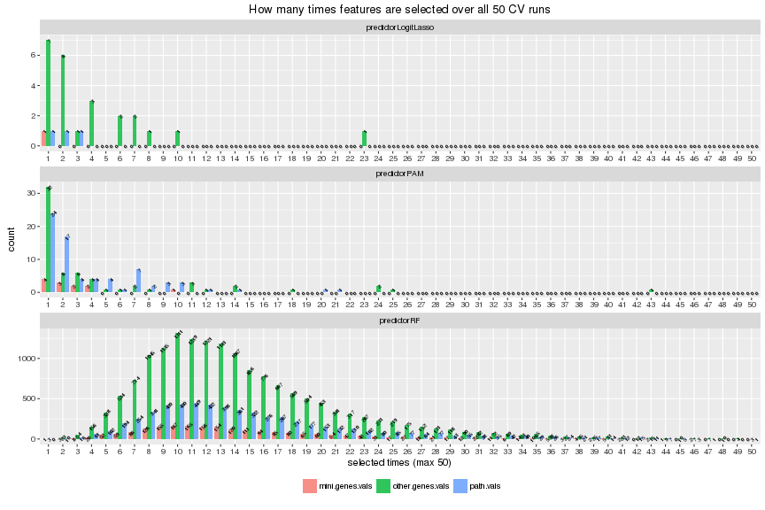

# Feature selection
# Yunlong Jiao, 02 May 2016

This script studies feature selection with representative FS algorithms to distinguish importance of features. And finally sees which feature type when a model is learned based on multiple feature types is more interesting in an overall comparison. Specifically we
- run independent significance t.test gene-by-gene or pathway-by-pathway and see the p-values from different types of features
- look at feature selection results from prediction made with pulled features of path.vals and genes.vals


```r
knitr::opts_chunk$set(error = FALSE, fig.width = 12, fig.height = 8, dev = c("png","pdf"), fig.keep = "high", fig.path = "5_featselect_figure/", cache.path = "5_featselect_cache/")
set.seed(17766220)
source("../../src/func.R")
library(reshape2)
library(ggplot2)
```

First load in workspace and read in parameters!


```r
# load in workspace
load("dat.RData")
rm(list = ls(pattern="[.]kmat$"))
# read in parameters
param <- read.table("2_runPredict.txt", header = FALSE, row.names = NULL, col.names = c("xname", "yname", "prname", "i.fold", "nfolds", "nrepeats", "i.fold.inn", "nfolds.inn", "nrepeats.inn"))
# features
xlist <- unique(param$xname)
xlist
```

```
##  [1] "eff.vals"                  "fun.vals"                 
##  [3] "genes.vals"                "go.vals"                  
##  [5] "mini.genes.vals"           "other.genes.vals"         
##  [7] "path.vals"                 "eff.and.other.genes.vals" 
##  [9] "path.and.other.genes.vals" "path.and.genes.vals"
```

```r
# feature types # the following order is fairly important
xlist.type <- c("func-wise", "func-wise", 
                "path-wise", "path-wise", 
                "gene-wise", "gene-wise", "gene-wise", 
                "mix-wise", "mix-wise", "mix-wise")
names(xlist.type) <- c("fun.vals", "go.vals", # functionality features
                       "eff.vals", "path.vals", # pathway features
                       "mini.genes.vals", "other.genes.vals", "genes.vals", # gene features
                       "eff.and.other.genes.vals", "path.and.other.genes.vals", "path.and.genes.vals") # mixed type
xlist.vline <- c(2.5, 4.5, 7.5) # cut out types
stopifnot(length(setdiff(xlist, names(xlist.type))) == 0)
xlist.type
```

```
##                  fun.vals                   go.vals 
##               "func-wise"               "func-wise" 
##                  eff.vals                 path.vals 
##               "path-wise"               "path-wise" 
##           mini.genes.vals          other.genes.vals 
##               "gene-wise"               "gene-wise" 
##                genes.vals  eff.and.other.genes.vals 
##               "gene-wise"                "mix-wise" 
## path.and.other.genes.vals       path.and.genes.vals 
##                "mix-wise"                "mix-wise"
```

```r
# features to perform indep signif test
xlist.test <- grep("[.]and[.]|^genes", xlist, value = TRUE, invert = TRUE)
xlist.test <- xlist.test[order(match(xlist.test, names(xlist.type)))]
xlist.test
```

```
## [1] "fun.vals"         "go.vals"          "eff.vals"        
## [4] "path.vals"        "mini.genes.vals"  "other.genes.vals"
```

```r
# groups
ylist <- unique(param$yname)
ylist
```

```
## [1] "surv.grps"
```

```r
# predictors
prlist <- unique(param$prname)
prlist
```

```
##  [1] "predictorConstant"   "predictorGBM"        "predictorKendallSVM"
##  [4] "predictorKNN"        "predictorLDA"        "predictorLinearSVM" 
##  [7] "predictorLogitLasso" "predictorNB"         "predictorPAM"       
## [10] "predictorRadialSVM"  "predictorRF"         "predictorSparseSVM"
```

```r
# predictors that automate feat select
prlist.fs <- c("predictorLogitLasso","predictorPAM","predictorRF")
prlist.fs <- prlist.fs[prlist.fs %in% prlist]
prlist.fs
```

```
## [1] "predictorLogitLasso" "predictorPAM"        "predictorRF"
```

```r
# (outter) `nfolds`-fold CV repeated `nrepeats` times for evaluation
nfolds <- unique(param$nfolds)
stopifnot(length(nfolds) == 1)
nfolds
```

```
## [1] 5
```

```r
nrepeats <- unique(param$nrepeats)
stopifnot(length(nrepeats) == 1)
nrepeats
```

```
## [1] 10
```

```r
# inner `nfolds.inn`-fold CV repeated `nrepeats.inn` times for tuning predictors
nfolds.inn <- unique(param$nfolds.inn)
stopifnot(length(nfolds.inn) == 1)
nfolds.inn
```

```
## [1] 5
```

```r
nrepeats.inn <- unique(param$nrepeats.inn)
stopifnot(length(nrepeats.inn) == 1)
nrepeats.inn
```

```
## [1] 1
```

```r
# evaluation measures
slist <- c("acc","fpr","tpr","ppv","fval", "auroc")
slist
```

```
## [1] "acc"   "fpr"   "tpr"   "ppv"   "fval"  "auroc"
```

```r
slist.prefer.large.score <- c(TRUE, FALSE, TRUE, TRUE, TRUE, TRUE)
names(slist.prefer.large.score) <- slist
slist.prefer.large.score
```

```
##   acc   fpr   tpr   ppv  fval auroc 
##  TRUE FALSE  TRUE  TRUE  TRUE  TRUE
```

## Independent significance t.test

For each `yname` in surv.grps, we run independent significance t.test for each pathway and each gene individually and look at the returned p-values. (In case of multiple levels, we run t.test against binary labels that discriminate the last level vs the other levels.) In the end we have several different plots to illustrate the results.


```r
# read in param
param2 <- read.table("4_indepsignif.txt", header = FALSE, row.names = NULL, col.names = c("xname", "yname", "i.fold", "nfolds", "nrepeats", "pthres", "test", "method"))
stopifnot(length(setdiff(xlist.test, unique(param2$xname))) == 0)
stopifnot(length(setdiff(ylist, unique(param2$yname))) == 0)
stopifnot(all(nfolds == unique(param2$nfolds)))
stopifnot(all(nrepeats == unique(param2$nrepeats)))
# pthres
pthres <- unique(param2$pthres)
stopifnot(length(pthres) == 1)
pthres
```

```
## [1] 0.05
```

```r
# test
test <- unique(param2$test)
stopifnot(length(test) == 1)
test
```

```
## [1] "t.test"
```

```r
# method for multiple correction should be 'none' and correction is left to be done later
method <- unique(param2$method)
stopifnot(all(unique(method) == "none"))
method
```

```
## [1] "none"
```

```r
# show each grp separately
for (yname in ylist) {
  plist <- lapply(xlist.test, function(xname){
    message(yname, '\t', xname)
    res.files <- list.files(path = 'Robj', 
                            pattern = paste('^plist', xname, yname, 
                                            '[[:digit:]]+', nfolds, nrepeats, 
                                            pthres, test, method, 
                                            sep = '_'), 
                            full.names = TRUE)
    res <- lapply(res.files, function(f){
      v <- get(load(f))
      stopifnot(is.vector(v))
      as.data.frame(t(v)) # convert to data.frame to facilitate further rbind
    })
    res <- do.call('rbind', res)
    return(res)
  })
  xlist.factor <- factor(rep(xlist.test, sapply(plist, ncol)), levels = xlist.test)
  plist <- do.call('cbind', plist)
  # multiple test correction for each CV run where transpose to maintain same dim
  plist <- t(apply(plist, 1, p.adjust, method = "BH"))
  # average p-values over all CV runs
  plist <- colMeans(plist)
  # split up to each type of features
  plist <- split(plist, xlist.factor)
  # sort by increasing p-value in each group
  plist <- lapply(plist, sort, decreasing = FALSE)
  assign(paste0(yname,"_plist"), plist)
  rm(plist)
}
```

For each `yname` in surv.grps, we have several plots to illustrate the results
- Boxplots of p-values of feature-by-feature t.test is used to show the variance of feature significance for different feature types. Two plots correpond to that with all features, or that with only significant features at a p-value less than `pthres`.
- Lineplot of the accumulated proportion defined by the number of significant features within each type (at increasing p-value thresholds) divided by the total number of features from that specific type. The number on line is the absolute count of number of significant features within each type.
- Barplot of the proportion defined by the number of significant features within each type divided by the number of significant features of all types pulled together (at increasing p-value thresholds). The number on bar is the absolute count of number of significant features within each type.


```r
# show each grp separately
for (yname in ylist) {
  cat('\n---> \t Independent significance', test, '\t <---\n')
  cat('\n---------> \t for ', yname, ' \t <---------\n')
  plist <- get(paste0(yname,"_plist"))
  # show top 10 signif features
  cat('\nPreview of top 10 most signif features in each type\n')
  print(lapply(plist, head, n = 10))
  plist.melt <- melt(plist, level = 1, value.name = "value")
  colnames(plist.melt)[colnames(plist.melt)=="L1"] <- "xname"
  plist.melt$xname <- factor(plist.melt$xname, levels = xlist.test, ordered = TRUE)
  
  # feature-by-feature p-values
  cat('\nBoxplots of p-values of feature-by-feature', test, '\n')
  p1 <- ggplot(plist.melt, aes(x = xname, y = value)) + 
    geom_boxplot(aes(fill = xname), alpha = 0.8) + 
    scale_x_discrete(name = "x") + 
    scale_y_continuous(trans = "log10", limits = c(0.01, 1), name = "p-value") + 
    ggtitle("All features") + 
    theme(axis.text.x = element_blank(), legend.title = element_blank(), legend.position = "bottom")
  p2 <- ggplot(subset(plist.melt, value < pthres), aes(x = xname, y = value)) + 
    geom_boxplot(aes(fill = xname), alpha = 0.8) + 
    scale_x_discrete(name = "x") + 
    scale_y_continuous(limits = c(0.01, pthres), name = "p-value") + 
    ggtitle(paste0("Significant features only (p-value<", pthres, ")")) + 
    theme(axis.text.x = element_blank(), legend.title = element_blank(), legend.position = "bottom")
  multiplot(p1, p2, cols = 2)
  
  # make a list of pthres in log-scale and count the number of features being signif within each type
  pthres.min <- quantile(plist.melt$value[plist.melt$value<pthres], 0.01)
  pthreslist <- pthres.min*exp(seq(0,1,length.out=20)*log(pthres/pthres.min))
  plist.tab <- lapply(pthreslist, function(pthres){
    table(subset(plist.melt, subset = (value < pthres), select = "xname"))
  })
  names(plist.tab) <- formatC(pthreslist, digits = 2, format = "e")
  plist.tab <- do.call('rbind', plist.tab)
  
  # compared within each type
  plist.freq <- melt(plist.tab, varnames = c("pthres", "type"), value.name = "value")
  n.featlist <- sapply(xlist.test, function(xname) length(plist[[xname]]))
  plist.freq$freq <- plist.freq$value/n.featlist[plist.freq$type]
  cat('\nTotal number of features within each type\n')
  print(n.featlist)
  p1 <- ggplot(plist.freq, aes(x = factor(pthres), y = freq)) + 
    geom_line(aes(group = type, colour = type), stat="identity", alpha = 0.8) + 
    geom_text(aes(label = value, colour = type), size = 5) + 
    scale_x_discrete(name = "at p-value threshold (less than)") + 
    scale_y_continuous(name = "Proportion (%)") + 
    ggtitle("Accumulated proportion of signif features within each type (%)")
  plot(p1)
  
  # pull and compare across types
  plist.pull <- melt(plist.tab, varnames = c("pthres", "type"), value.name = "value")
  n.featsignif <- rowSums(plist.tab)
  plist.pull$freq <- plist.pull$value/n.featsignif[match(plist.pull$pthres, as.numeric(names(n.featsignif)))]
  p1 <- ggplot(plist.pull, aes(x = factor(pthres), y = freq)) + 
    geom_bar(aes(fill = type), stat="identity", position = "stack", alpha = 0.8) + 
    geom_text(aes(label = value), size = 5, colour = "black", position = "stack", vjust = 0.9) + 
    scale_x_discrete(name = "at p-value threshold (less than)") + 
    scale_y_continuous(name = "Proportion (%)") + 
    ggtitle("Accumulated proportion of signif features across different types (%)")
  plot(p1)
}
```

```
## 
## ---> 	 Independent significance t.test 	 <---
## 
## ---------> 	 for  surv.grps  	 <---------
## 
## Preview of top 10 most signif features in each type
## $fun.vals
##           X_Acute_phase     X_Growth_regulation     X_Antiviral_defense 
##              0.02195639              0.03688131              0.04606539 
##      X_Lipid_metabolism       X_Gluconeogenesis X_Fatty_acid_metabolism 
##              0.04722444              0.07470178              0.07739417 
##             X_Transport       X_DNA_replication       X_Sugar_transport 
##              0.08000903              0.09733113              0.10073644 
##            X_Myogenesis 
##              0.10517222 
## 
## $go.vals
##             X_plasma_membrane_long_chain_fatty_acid_transport 
##                                                    0.03544728 
##                                         X_glucose_homeostasis 
##                                                    0.04059181 
##                     X_long_chain_fatty_acid_metabolic_process 
##                                                    0.04139708 
##                                   X_cellular_response_to_cGMP 
##                                                    0.04788405 
##              X_positive_regulation_of_protein_kinase_activity 
##                                                    0.04941048 
##                            X_SMAD_protein_signal_transduction 
##                                                    0.04983936 
##                     X_internal_protein_amino_acid_acetylation 
##                                                    0.04994568 
##                                         X_response_to_insulin 
##                                                    0.05292064 
## X_positive_regulation_of_epithelial_to_mesenchymal_transition 
##                                                    0.05512630 
##                                    X_malate_metabolic_process 
##                                                    0.05533125 
## 
## $eff.vals
##  X_hsa04670__55  X_hsa03320__27  X_hsa04670__54 X_hsa05200__216 
##      0.01109745      0.01606777      0.01878604      0.02048068 
##  X_hsa04010__54  X_hsa04670__76  X_hsa04152__44  X_hsa04620__39 
##      0.02145506      0.02545557      0.02916456      0.02967248 
##  X_hsa04920__43 X_hsa05205__352 
##      0.03121700      0.03512421 
## 
## $path.vals
##    X_hsa04068__79___46 X_hsa04670__65_66___55    X_hsa04068__79___13 
##             0.01138623             0.01213554             0.01246549 
##    X_hsa04068__79___49    X_hsa04068__79___66    X_hsa04068__79___45 
##             0.01261108             0.01274047             0.01344064 
##    X_hsa04350__53___28    X_hsa04068__80___46 X_hsa04670__66_67___55 
##             0.01359745             0.01421760             0.01431749 
##    X_hsa04068__79___68 
##             0.01503216 
## 
## $mini.genes.vals
##    X_353500     X_51176      X_1301      X_2335     X_50615      X_7040 
## 0.008484986 0.018453410 0.019401790 0.019472172 0.019808361 0.020311478 
##     X_81617      X_3381      X_4318      X_5296 
## 0.020664765 0.021653936 0.022260977 0.022558407 
## 
## $other.genes.vals
##    X_200504      X_6439     X_49854      X_6531      X_8338    X_403244 
## 0.004958970 0.006048960 0.008594272 0.008760405 0.009499787 0.009589758 
##      X_8462      X_6908    X_728190      X_5624 
## 0.009648267 0.009864103 0.010974179 0.011221382 
## 
## 
## Boxplots of p-values of feature-by-feature t.test
```

```
## Warning: Removed 9 rows containing non-finite values (stat_boxplot).

## Warning: Removed 9 rows containing non-finite values (stat_boxplot).
```



```
## 
## Total number of features within each type
##         fun.vals          go.vals         eff.vals        path.vals 
##               81              370             1031             6056 
##  mini.genes.vals other.genes.vals 
##             2142            16496
```



## Algorithmic feature selection

For each `yname` in surv.grps, prediction is made with pulled types of features, that is a naive combination of path.vals and genes.vals. We look at the frequency of each type of features being selected automatically.


```r
xname <- "path.and.genes.vals" # do not alter
xname.list <- c("mini.genes.vals", "other.genes.vals", "path.vals") # do not alter
featlist.long <- lapply(xname.list, function(u){
  colnames(get(u))
})
names(featlist.long) <- xname.list
n.featlist.long <- sapply(featlist.long, length)
# show each grp separately
for (yname in ylist) {
  for (prname in prlist.fs) {
    message(yname, '\t', prname)
    res.files <- list.files(path = 'Robj', 
                            pattern = paste('^ivres', xname, yname, prname, 
                                            '[[:digit:]]+', nfolds, nrepeats, 
                                            0, nfolds.inn, nrepeats.inn, 
                                            sep = '_'), 
                            full.names = TRUE)
    res <- lapply(res.files, function(f) get(load(f)))
    names(res) <- paste0("rep",1:length(res))
    
    # scores
    scores <- lapply(res, '[', slist)
    scores <- melt(scores, level = 1, value.name = "value")
    colnames(scores)[colnames(scores)=="L1"] <- "rep"
    colnames(scores)[colnames(scores)=="L2"] <- "score"
    scores$prname <- prname
    rownames(scores) <- 1:nrow(scores)
    assign(paste(yname,prname,"scores",sep="_"), scores)
    
    # featselect
    featlist.short <- lapply(res, '[[', 'featlist.short')
    featlist.short <- lapply(featlist.long, function(u){
      lapply(featlist.short, function(v){
        intersect(u,v)
      })
    })
    assign(paste(yname,prname,"featlist.short",sep="_"), featlist.short)
    rm(res)
  }
}
```

For each `yname` in surv.grps, we have several plots to illustrate the results
- Boxplot of prediction performance using pulled feature set path.and.genes.vals, wrt different criterion and different prediction algorithm, where variance shows over 50 CV runs.
- Three boxplots on the number of selected features from each feature type in mini.genes.vals, other.genes.vals, path.vals, wrt different algorithms, where variance shows at each CV run. Three of them each correpond to 1) total count of selected features from each type; 2) total count of selected features from each type divided by the total number of selected features of all types; 3) total count of selected features from each type divided by the total number of features from that same type.
- Histogram of how many times one feature are selected in total over all 50 CV runs, specific to each type and each algorithm.


```r
# show each grp separately
for (yname in ylist) {
  cat('\n---> \t Algorithmic feature selection \t <---\n')
  cat('\n---------> \t for ', yname, ' \t <---------\n')
  # scores
  scores <- lapply(prlist.fs, function(prname){
    get(paste(yname,prname,"scores",sep="_"))
  })
  scores <- do.call('rbind', scores)
  scores$value[scores$score == "fpr"] <- 1 - scores$value[scores$score == "fpr"]
  scores$score[scores$score == "fpr"] <- "spec"
  scores$score[scores$score == "tpr"] <- "sens"
  p1 <- ggplot(scores, aes(x = prname, y = value)) + 
    geom_boxplot(aes(fill = prname), alpha = 0.8) + 
    facet_wrap(~score, scales = "free") + 
    ggtitle(paste0("predicting ", yname, " with ", xname)) + 
    theme(axis.text.x = element_blank())
  plot(p1)
  
  # featselect
  featlist.short <- lapply(prlist.fs, function(prname){
    get(paste(yname,prname,"featlist.short",sep="_"))
  })
  names(featlist.short) <- prlist.fs
  # featlist.short is 3-layer list prlist.fs -> xname.list -> CV repeats -> a character vector of feature names
  # number of features are selected at each CV run
  featlist.freq <- lapply(featlist.short, function(u) lapply(u, lapply, length))
  featlist.freq <- melt(featlist.freq, level = 1, value.name = "value")
  colnames(featlist.freq)[colnames(featlist.freq)=="L1"] <- "prname"
  colnames(featlist.freq)[colnames(featlist.freq)=="L2"] <- "xname"
  colnames(featlist.freq)[colnames(featlist.freq)=="L3"] <- "rep"
  p1 <- ggplot(featlist.freq, aes(x = xname, y = value)) + 
    geom_boxplot(aes(fill = xname), alpha = 0.8) + 
    facet_wrap(~prname, scales = "free") + 
    scale_x_discrete(name = "x") + 
    scale_y_continuous(name = "Number of selected features") + 
    ggtitle(paste0("How many features are selected at each run")) + 
    theme(axis.text.x = element_blank(), legend.title = element_blank(), legend.position = "bottom")
  plot(p1)
  # proportion across group
  n.featlist.short <- tapply(featlist.freq$value, list(featlist.freq$rep, featlist.freq$prname), sum)
  cat('\nTotal number of features selected at each run (averaged over each CV run)\n')
  print(colMeans(n.featlist.short))
  featlist.freq$prop <- featlist.freq$value/n.featlist.short[cbind(featlist.freq$rep,featlist.freq$prname)]
  p2 <- ggplot(featlist.freq, aes(x = xname, y = prop)) + 
    geom_boxplot(aes(fill = xname), alpha = 0.8) + 
    facet_wrap(~prname, scales = "free") + 
    scale_x_discrete(name = "x") + 
    scale_y_continuous(name = "Proportion") + 
    ggtitle(paste0("Proportion of features selected across types at each run")) + 
    theme(axis.text.x = element_blank(), legend.title = element_blank(), legend.position = "bottom")
  plot(p2)
  # proportion within group
  cat('\nTotal number of features within each type\n')
  print(n.featlist.long)
  featlist.freq$freq <- featlist.freq$value/n.featlist.long[featlist.freq$xname]
  p3 <- ggplot(featlist.freq, aes(x = xname, y = freq)) + 
    geom_boxplot(aes(fill = xname), alpha = 0.8) + 
    facet_wrap(~prname, scales = "free") + 
    scale_x_discrete(name = "x") + 
    scale_y_continuous(name = "Proportion") + 
    ggtitle(paste0("Proportion of features selected within own type at each run")) + 
    theme(axis.text.x = element_blank(), legend.title = element_blank(), legend.position = "bottom")
  plot(p3)
  
  # show top 3 most selected features in each type by predictor
  featlist.tab <- lapply(featlist.short, function(u) lapply(u, function(v) 
    sort(table(unlist(v)), decreasing = TRUE)
  ))
  cat('\nPreview of top 10 most often selected features in each type\n')
  print(lapply(featlist.tab, function(u) lapply(u, head, n=10)))
  
  # count number of times of features from each type being selected over CV runs
  featlist.count <- melt(featlist.tab, level = 1, value.name = "value")
  colnames(featlist.count)[colnames(featlist.count)=="L1"] <- "prname"
  colnames(featlist.count)[colnames(featlist.count)=="L2"] <- "xname"
  colnames(featlist.count)[colnames(featlist.count)=="Var1"] <- "featname"
  featlist.count <- dcast(featlist.count, prname+xname~value, fun.aggregate = length)
  featlist.count <- melt(featlist.count, id.vars = c("prname","xname"))
  p1 <- ggplot(featlist.count, aes(x = variable, y = value)) + 
    geom_bar(aes(fill = xname), stat = "identity", position = "dodge", alpha = 0.8) + 
    geom_text(aes(label = value, group = xname), size = 2, angle = 45, colour = "black", position = position_dodge(0.9), vjust = 0.9) + 
    facet_wrap(~prname, scales = "free", ncol = 1) + 
    scale_x_discrete(name = paste0("selected times (max ", nfolds*nrepeats, ")")) + 
    scale_y_continuous(name = "count") + 
    ggtitle(paste0("How many times features are selected over all ", nfolds*nrepeats, " CV runs")) + 
    theme(legend.title = element_blank(), legend.position = "bottom")
  plot(p1)
}
```

```
## 
## ---> 	 Algorithmic feature selection 	 <---
## 
## ---------> 	 for  surv.grps  	 <---------
```

```
## Warning: Removed 204 rows containing non-finite values (stat_boxplot).
```



```
## 
## Total number of features selected at each run (averaged over each CV run)
## predictorLogitLasso        predictorPAM         predictorRF 
##                2.16               13.06             9836.60
```

```
## Warning: Removed 102 rows containing non-finite values (stat_boxplot).
```



```
## 
## Total number of features within each type
##  mini.genes.vals other.genes.vals        path.vals 
##             2212            16496             6101
```



```
## 
## Preview of top 10 most often selected features in each type
## $predictorLogitLasso
## $predictorLogitLasso$mini.genes.vals
## X_353500 
##        1 
## 
## $predictorLogitLasso$other.genes.vals
## 
## X_340273  X_49854   X_8338   X_6531   X_8840 X_149647  X_57482   X_6908 
##       23       10        8        7        7        6        6        4 
##   X_7071   X_8462 
##        4        4 
## 
## $predictorLogitLasso$path.vals
## 
##    X_hsa04068__79___46 X_hsa04151__49_50___36    X_hsa04068__80___46 
##                      3                      2                      1 
## 
## 
## $predictorPAM
## $predictorPAM$mini.genes.vals
## 
## X_353500   X_2335   X_6356   X_1301   X_2277   X_1654   X_3164   X_5296 
##       10        4        4        3        3        2        2        2 
##   X_3381   X_3569 
##        1        1 
## 
## $predictorPAM$other.genes.vals
## 
## X_340273  X_49854   X_8338   X_8462   X_8840   X_1469 X_149647   X_2706 
##       43       25       24       24       18       14       14       12 
##  X_23177  X_57482 
##       11       11 
## 
## $predictorPAM$path.vals
## 
##    X_hsa04068__79___46    X_hsa04068__79___13    X_hsa04066__72___53 
##                     21                     20                     14 
##    X_hsa04151__47___36    X_hsa04068__79___45    X_hsa04068__80___46 
##                     12                     10                     10 
## X_hsa04151__49_50___36 X_hsa04151__22_81___36    X_hsa04151__59___36 
##                     10                      9                      9 
##    X_hsa04151__90___36 
##                      9 
## 
## 
## $predictorRF
## $predictorRF$mini.genes.vals
## 
##  X_5346 X_10411  X_4842  X_5138  X_6358 X_64805  X_9370  X_3815  X_5348 
##      50      49      49      48      48      48      48      46      46 
##  X_6869 
##      46 
## 
## $predictorRF$other.genes.vals
## 
##  X_1020   X_125  X_1960 X_22915  X_2532  X_3491  X_4976 X_65992  X_6944 
##      50      50      50      50      50      50      50      50      50 
## X_79174 
##      50 
## 
## $predictorRF$path.vals
## 
##  X_hsa04024__82___21 X_hsa04064__13___129   X_hsa04920__14___2 
##                   50                   50                   50 
## X_hsa04024__131___76  X_hsa04024__79___21  X_hsa04024__80___21 
##                   49                   49                   49 
##  X_hsa04024__80___59  X_hsa04024__81___21  X_hsa04024__90___59 
##                   49                   49                   49 
##  X_hsa04066__68___58 
##                   49
```



## Session info


```r
sessionInfo()
```

```
## R version 3.2.1 (2015-06-18)
## Platform: x86_64-unknown-linux-gnu (64-bit)
## 
## locale:
##  [1] LC_CTYPE=en_US.UTF-8       LC_NUMERIC=C              
##  [3] LC_TIME=en_US.UTF-8        LC_COLLATE=en_US.UTF-8    
##  [5] LC_MONETARY=en_US.UTF-8    LC_MESSAGES=en_US.UTF-8   
##  [7] LC_PAPER=en_US.UTF-8       LC_NAME=C                 
##  [9] LC_ADDRESS=C               LC_TELEPHONE=C            
## [11] LC_MEASUREMENT=en_US.UTF-8 LC_IDENTIFICATION=C       
## 
## attached base packages:
## [1] grid      methods   stats     graphics  grDevices utils     datasets 
## [8] base     
## 
## other attached packages:
## [1] ggplot2_2.1.0  reshape2_1.4.1
## 
## loaded via a namespace (and not attached):
##  [1] Rcpp_0.12.1      digest_0.6.8     plyr_1.8.3       gtable_0.1.2    
##  [5] formatR_1.3      magrittr_1.5     evaluate_0.8.3   scales_0.3.0    
##  [9] stringi_1.0-1    labeling_0.3     tools_3.2.1      stringr_1.0.0   
## [13] munsell_0.4.2    colorspace_1.2-6 knitr_1.12.3
```
