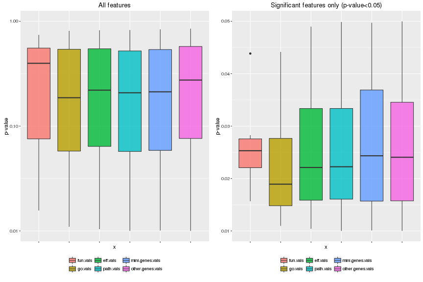
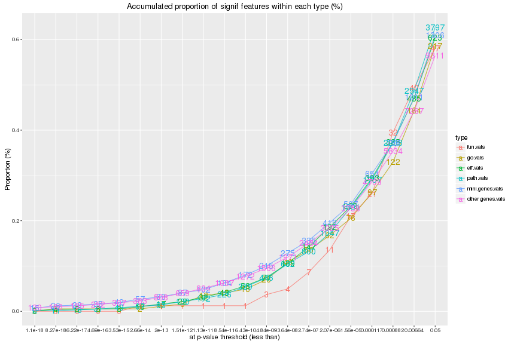
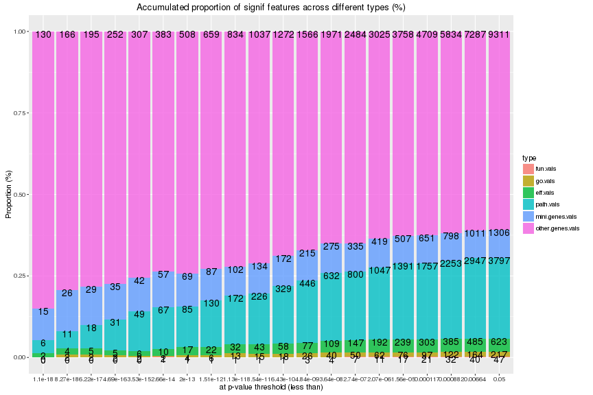
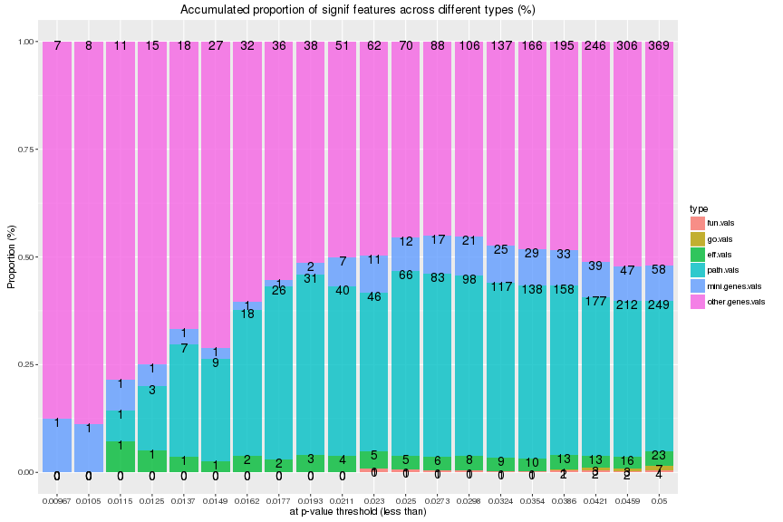
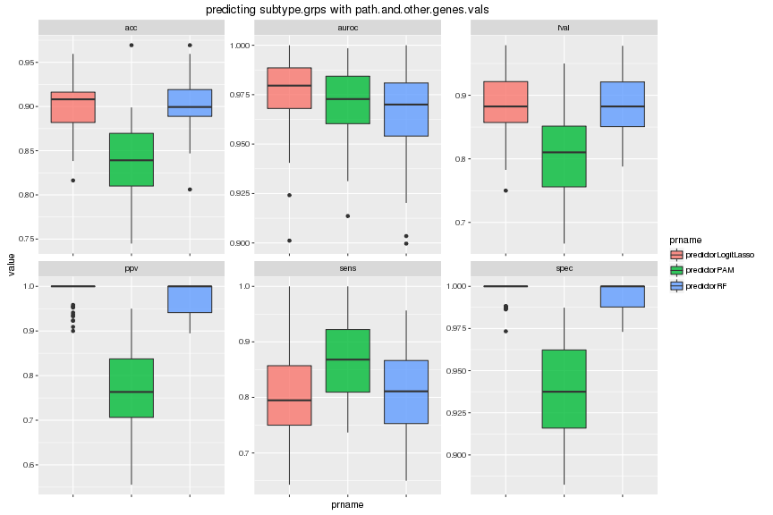
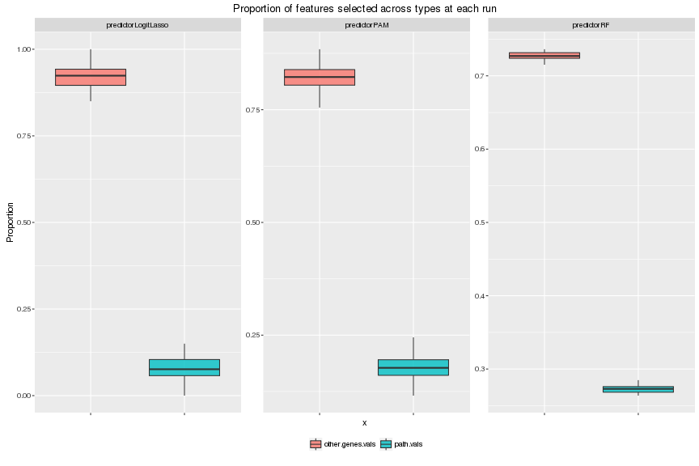
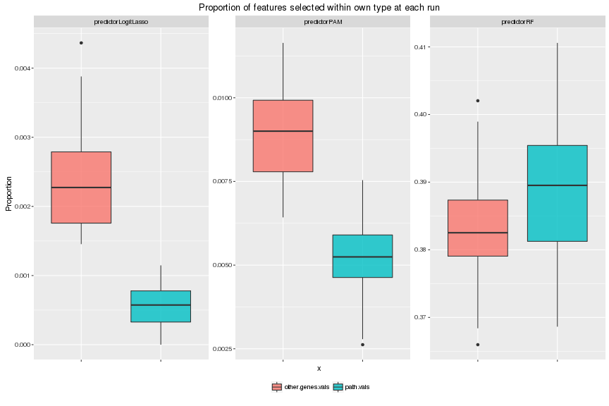
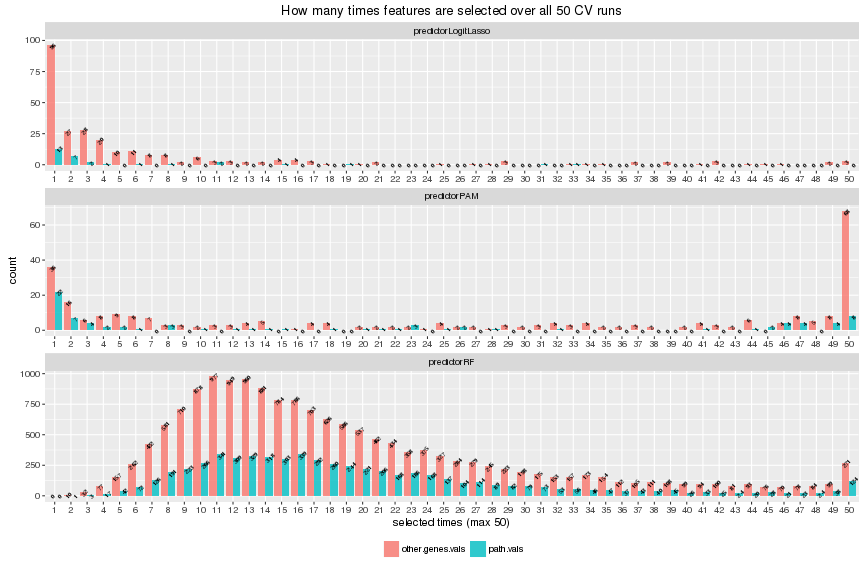
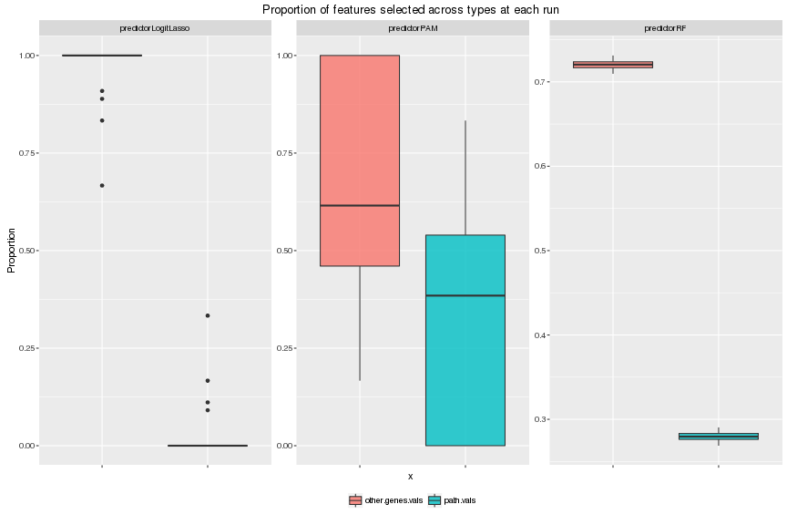
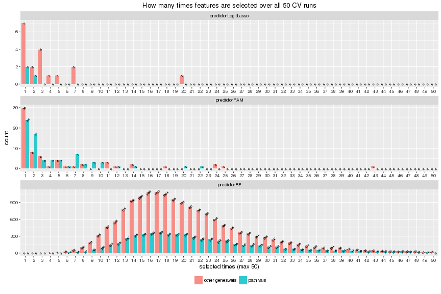

# Feature selection
# Yunlong Jiao, 02 May 2016

This script studies feature selection with representative FS algorithms to distinguish importance of features. And finally sees which feature type when a model is learned based on multiple feature types is more interesting in an overall comparison. Specifically we
- run independent significance t.test gene-by-gene or pathway-by-pathway and see the p-values from different types of features
- look at feature selection results from prediction made with pulled features of path.vals and genes.vals


```r
knitr::opts_chunk$set(error = FALSE, fig.width = 12, fig.height = 8, dev = c("png","pdf"), fig.keep = "high", fig.path = "5_featselect_figure/", cache.path = "5_featselect_cache/")
set.seed(17766220)
source("../../src/func.R")
library(reshape2)
library(ggplot2)
```

First load in workspace and read in parameters!


```r
# load in workspace
load("dat.RData")
rm(list = ls(pattern="[.]kmat$"))
# read in parameters
param <- read.table("2_runPredict.txt", header = FALSE, row.names = NULL, col.names = c("xname", "yname", "prname", "i.fold", "nfolds", "nrepeats", "i.fold.inn", "nfolds.inn", "nrepeats.inn"))
# features
xlist <- unique(param$xname)
xlist
```

```
##  [1] "eff.vals"                  "fun.vals"                 
##  [3] "genes.vals"                "go.vals"                  
##  [5] "mini.genes.vals"           "other.genes.vals"         
##  [7] "path.vals"                 "eff.and.other.genes.vals" 
##  [9] "eff.and.genes.vals"        "path.and.other.genes.vals"
## [11] "path.and.genes.vals"
```

```r
# feature types # the following order is fairly important
xlist.type <- c("func-wise", "func-wise", 
                "path-wise", "path-wise", 
                "gene-wise", "gene-wise", "gene-wise", 
                "mix-wise", "mix-wise", "mix-wise", "mix-wise")
names(xlist.type) <- c("fun.vals", "go.vals", # functionality features
                       "eff.vals", "path.vals", # pathway features
                       "mini.genes.vals", "other.genes.vals", "genes.vals", # gene features
                       "eff.and.other.genes.vals", "eff.and.genes.vals", "path.and.other.genes.vals", "path.and.genes.vals") # mixed type
xlist.vline <- c(2.5, 4.5, 7.5) # cut out types
stopifnot(length(setdiff(xlist, names(xlist.type))) == 0)
xlist.type
```

```
##                  fun.vals                   go.vals 
##               "func-wise"               "func-wise" 
##                  eff.vals                 path.vals 
##               "path-wise"               "path-wise" 
##           mini.genes.vals          other.genes.vals 
##               "gene-wise"               "gene-wise" 
##                genes.vals  eff.and.other.genes.vals 
##               "gene-wise"                "mix-wise" 
##        eff.and.genes.vals path.and.other.genes.vals 
##                "mix-wise"                "mix-wise" 
##       path.and.genes.vals 
##                "mix-wise"
```

```r
# features to perform indep signif test
xlist.test <- grep("[.]and[.]|^genes", xlist, value = TRUE, invert = TRUE)
xlist.test <- xlist.test[order(match(xlist.test, names(xlist.type)))]
xlist.test
```

```
## [1] "fun.vals"         "go.vals"          "eff.vals"        
## [4] "path.vals"        "mini.genes.vals"  "other.genes.vals"
```

```r
# groups
ylist <- unique(param$yname)
ylist
```

```
## [1] "subtype.grps" "surv.grps"
```

```r
# predictors
prlist <- unique(param$prname)
prlist
```

```
##  [1] "predictorConstant"   "predictorGBM"        "predictorKendallSVM"
##  [4] "predictorKNN"        "predictorLDA"        "predictorLinearSVM" 
##  [7] "predictorLogitLasso" "predictorNB"         "predictorPAM"       
## [10] "predictorRadialSVM"  "predictorRF"         "predictorSparseSVM"
```

```r
# predictors that automate feat select
prlist.fs <- c("predictorLogitLasso","predictorPAM","predictorRF")
prlist.fs <- prlist.fs[prlist.fs %in% prlist]
prlist.fs
```

```
## [1] "predictorLogitLasso" "predictorPAM"        "predictorRF"
```

```r
# (outter) `nfolds`-fold CV repeated `nrepeats` times for evaluation
nfolds <- unique(param$nfolds)
stopifnot(length(nfolds) == 1)
nfolds
```

```
## [1] 5
```

```r
nrepeats <- unique(param$nrepeats)
stopifnot(length(nrepeats) == 1)
nrepeats
```

```
## [1] 10
```

```r
# inner `nfolds.inn`-fold CV repeated `nrepeats.inn` times for tuning predictors
nfolds.inn <- unique(param$nfolds.inn)
stopifnot(length(nfolds.inn) == 1)
nfolds.inn
```

```
## [1] 5
```

```r
nrepeats.inn <- unique(param$nrepeats.inn)
stopifnot(length(nrepeats.inn) == 1)
nrepeats.inn
```

```
## [1] 1
```

```r
# evaluation measures
slist <- c("acc","fpr","tpr","ppv","fval", "auroc")
slist
```

```
## [1] "acc"   "fpr"   "tpr"   "ppv"   "fval"  "auroc"
```

```r
slist.prefer.large.score <- c(TRUE, FALSE, TRUE, TRUE, TRUE, TRUE)
names(slist.prefer.large.score) <- slist
slist.prefer.large.score
```

```
##   acc   fpr   tpr   ppv  fval auroc 
##  TRUE FALSE  TRUE  TRUE  TRUE  TRUE
```

## Independent significance t.test

For each `yname` in subtype.grps, surv.grps, we run independent significance t.test for each pathway and each gene individually and look at the returned p-values. (In case of multiple levels, we run t.test against binary labels that discriminate the last level vs the other levels.) In the end we have several different plots to illustrate the results.


```r
# read in param
param2 <- read.table("4_indepsignif.txt", header = FALSE, row.names = NULL, col.names = c("xname", "yname", "i.fold", "nfolds", "nrepeats", "pthres", "test", "method"))
stopifnot(length(setdiff(xlist.test, unique(param2$xname))) == 0)
stopifnot(length(setdiff(ylist, unique(param2$yname))) == 0)
stopifnot(all(nfolds == unique(param2$nfolds)))
stopifnot(all(nrepeats == unique(param2$nrepeats)))
# pthres
pthres <- unique(param2$pthres)
stopifnot(length(pthres) == 1)
pthres
```

```
## [1] 0.05
```

```r
# test
test <- unique(param2$test)
stopifnot(length(test) == 1)
test
```

```
## [1] "t.test"
```

```r
# method for multiple correction should be 'none' and correction is left to be done later
method <- unique(param2$method)
stopifnot(all(unique(method) == "none"))
method
```

```
## [1] "none"
```

```r
# show each grp separately
for (yname in ylist) {
  plist <- lapply(xlist.test, function(xname){
    message(yname, '\t', xname)
    res.files <- list.files(path = 'Robj', 
                            pattern = paste('^plist', xname, yname, 
                                            '[[:digit:]]+', nfolds, nrepeats, 
                                            pthres, test, method, 
                                            sep = '_'), 
                            full.names = TRUE)
    res <- lapply(res.files, function(f){
      v <- get(load(f))
      stopifnot(is.vector(v))
      as.data.frame(t(v)) # convert to data.frame to facilitate further rbind
    })
    res <- do.call('rbind', res)
    return(res)
  })
  xlist.factor <- factor(rep(xlist.test, sapply(plist, ncol)), levels = xlist.test)
  plist <- do.call('cbind', plist)
  # multiple test correction for each CV run where transpose to maintain same dim
  plist <- t(apply(plist, 1, p.adjust, method = "BH"))
  # average p-values over all CV runs
  plist <- colMeans(plist)
  # split up to each type of features
  plist <- split(plist, xlist.factor)
  # sort by increasing p-value in each group
  plist <- lapply(plist, sort, decreasing = FALSE)
  assign(paste0(yname,"_plist"), plist)
  rm(plist)
}
```

For each `yname` in subtype.grps, surv.grps, we have several plots to illustrate the results
- Boxplots of p-values of feature-by-feature t.test is used to show the variance of feature significance for different feature types. Two plots correpond to that with all features, or that with only significant features at a p-value less than `pthres`.
- Lineplot of the accumulated proportion defined by the number of significant features within each type (at increasing p-value thresholds) divided by the total number of features from that specific type. The number on line is the absolute count of number of significant features within each type.
- Barplot of the proportion defined by the number of significant features within each type divided by the number of significant features of all types pulled together (at increasing p-value thresholds). The number on bar is the absolute count of number of significant features within each type.


```r
# show each grp separately
for (yname in ylist) {
  cat('\n---> \t Independent significance', test, '\t <---\n')
  cat('\n---------> \t for ', yname, ' \t <---------\n')
  plist <- get(paste0(yname,"_plist"))
  # show top 10 signif features
  cat('\nPreview of top 10 most signif features in each type\n')
  print(lapply(plist, head, n = 10))
  plist.melt <- melt(plist, level = 1, value.name = "value")
  colnames(plist.melt)[colnames(plist.melt)=="L1"] <- "xname"
  plist.melt$xname <- factor(plist.melt$xname, levels = xlist.test, ordered = TRUE)
  
  # feature-by-feature p-values
  cat('\nBoxplots of p-values of feature-by-feature', test, '\n')
  p1 <- ggplot(plist.melt, aes(x = xname, y = value)) + 
    geom_boxplot(aes(fill = xname), alpha = 0.8) + 
    scale_x_discrete(name = "x") + 
    scale_y_continuous(trans = "log10", limits = c(0.01, 1), name = "p-value") + 
    ggtitle("All features") + 
    theme(axis.text.x = element_blank(), legend.title = element_blank(), legend.position = "bottom")
  p2 <- ggplot(subset(plist.melt, value < pthres), aes(x = xname, y = value)) + 
    geom_boxplot(aes(fill = xname), alpha = 0.8) + 
    scale_x_discrete(name = "x") + 
    scale_y_continuous(limits = c(0.01, pthres), name = "p-value") + 
    ggtitle(paste0("Significant features only (p-value<", pthres, ")")) + 
    theme(axis.text.x = element_blank(), legend.title = element_blank(), legend.position = "bottom")
  multiplot(p1, p2, cols = 2)
  
  # make a list of pthres in log-scale and count the number of features being signif within each type
  pthres.min <- quantile(plist.melt$value[plist.melt$value<pthres], 0.01)
  pthreslist <- pthres.min*exp(seq(0,1,length.out=20)*log(pthres/pthres.min))
  plist.tab <- lapply(pthreslist, function(pthres){
    table(subset(plist.melt, subset = (value < pthres), select = "xname"))
  })
  names(plist.tab) <- formatC(pthreslist, digits = 2, format = "e")
  plist.tab <- do.call('rbind', plist.tab)
  
  # compared within each type
  plist.freq <- melt(plist.tab, varnames = c("pthres", "type"), value.name = "value")
  n.featlist <- sapply(xlist.test, function(xname) length(plist[[xname]]))
  plist.freq$freq <- plist.freq$value/n.featlist[plist.freq$type]
  cat('\nTotal number of features within each type\n')
  print(n.featlist)
  p1 <- ggplot(plist.freq, aes(x = factor(pthres), y = freq)) + 
    geom_line(aes(group = type, colour = type), stat="identity", alpha = 0.8) + 
    geom_text(aes(label = value, colour = type), size = 5) + 
    scale_x_discrete(name = "at p-value threshold (less than)") + 
    scale_y_continuous(name = "Proportion (%)") + 
    ggtitle("Accumulated proportion of signif features within each type (%)")
  plot(p1)
  
  # pull and compare across types
  plist.pull <- melt(plist.tab, varnames = c("pthres", "type"), value.name = "value")
  n.featsignif <- rowSums(plist.tab)
  plist.pull$freq <- plist.pull$value/n.featsignif[match(plist.pull$pthres, as.numeric(names(n.featsignif)))]
  p1 <- ggplot(plist.pull, aes(x = factor(pthres), y = freq)) + 
    geom_bar(aes(fill = type), stat="identity", position = "stack", alpha = 0.8) + 
    geom_text(aes(label = value), size = 5, colour = "black", position = "stack", vjust = 0.9) + 
    scale_x_discrete(name = "at p-value threshold (less than)") + 
    scale_y_continuous(name = "Proportion (%)") + 
    ggtitle("Accumulated proportion of signif features across different types (%)")
  plot(p1)
}
```

```
## 
## ---> 	 Independent significance t.test 	 <---
## 
## ---------> 	 for  subtype.grps  	 <---------
## 
## Preview of top 10 most signif features in each type
## $fun.vals
##              X_Exocytosis X_Ubl_conjugation_pathway 
##              3.576248e-15              1.211838e-09 
##         X_Lipid_transport       X_Calcium_transport 
##              1.525778e-09              3.634076e-08 
##       X_Lipid_degradation                X_Antiport 
##              4.728324e-08              2.406929e-07 
## X_Sphingolipid_metabolism X_Fatty_acid_biosynthesis 
##              2.689499e-07              3.583507e-07 
##         X_Stress_response              X_Glycolysis 
##              5.859861e-07              8.722341e-07 
## 
## $go.vals
##                                                    X_JNK_cascade 
##                                                     6.937648e-18 
##                          X_microtubule_cytoskeleton_organization 
##                                                     6.985323e-18 
##                                       X_histone_H3_deacetylation 
##                                                     4.460813e-14 
##                                   X_superoxide_metabolic_process 
##                                                     1.150477e-13 
##                      X_phosphatidylcholine_acyl_chain_remodeling 
##                                                     6.062780e-13 
##                         X_positive_regulation_of_GTPase_activity 
##                                                     1.089602e-12 
## X_positive_regulation_of_DNA_templated_transcription__initiation 
##                                                     1.583364e-12 
##                                        X_protein_phosphorylation 
##                                                     1.683775e-12 
##                          X_glycerophospholipid_catabolic_process 
##                                                     2.142504e-12 
##                                           X_response_to_cytokine 
##                                                     2.860997e-12 
## 
## $eff.vals
##  X_hsa04919__39  X_hsa04914__34  X_hsa04914__39  X_hsa04010__14 
##    1.697419e-20    7.357707e-19    1.316372e-18    6.985323e-18 
## X_hsa05205__103  X_hsa04915__58  X_hsa04010__61  X_hsa04010__58 
##    2.174559e-17    8.855212e-16    4.204943e-15    5.760968e-15 
##  X_hsa04668__38  X_hsa04151__99 
##    1.590756e-14    1.698098e-14 
## 
## $path.vals
##  X_hsa04919__33___39  X_hsa04151__43___99 X_hsa05200__35___207 
##         1.166098e-22         8.049279e-21         5.069082e-20 
##   X_hsa04010__4___14  X_hsa04914__37___34 X_hsa04010__105___14 
##         1.709221e-19         7.357707e-19         8.100432e-19 
##  X_hsa04914__37___39 X_hsa04010__128___14 X_hsa05200__35___209 
##         1.316372e-18         1.540677e-18         2.654614e-18 
##   X_hsa04010__3___14 
##         5.909348e-18 
## 
## $mini.genes.vals
##       X_2099       X_3760       X_2925       X_8437       X_5613 
## 1.736439e-24 1.665528e-23 9.045372e-22 9.395027e-21 3.440422e-20 
##       X_8326       X_7066       X_8440      X_50604      X_57580 
## 4.999023e-20 7.998074e-20 9.074077e-20 9.334031e-20 1.243317e-19 
## 
## $other.genes.vals
##          X_9     X_161835       X_9120     X_112714      X_79624 
## 3.740884e-35 6.626610e-32 3.181627e-30 1.373118e-29 2.350734e-29 
##      X_25800     X_388468      X_25823      X_53335       X_8537 
## 1.799662e-28 2.341486e-27 2.681914e-26 4.048322e-26 1.993943e-25 
## 
## 
## Boxplots of p-values of feature-by-feature t.test
```

```
## Warning: Removed 12510 rows containing non-finite values (stat_boxplot).

## Warning: Removed 12510 rows containing non-finite values (stat_boxplot).
```



```
## 
## Total number of features within each type
##         fun.vals          go.vals         eff.vals        path.vals 
##               81              370             1031             6056 
##  mini.genes.vals other.genes.vals 
##             2142            16496
```



```
## 
## ---> 	 Independent significance t.test 	 <---
## 
## ---------> 	 for  surv.grps  	 <---------
## 
## Preview of top 10 most signif features in each type
## $fun.vals
##           X_Acute_phase     X_Growth_regulation     X_Antiviral_defense 
##              0.02195639              0.03688131              0.04606539 
##      X_Lipid_metabolism       X_Gluconeogenesis X_Fatty_acid_metabolism 
##              0.04722444              0.07470178              0.07739417 
##             X_Transport       X_DNA_replication       X_Sugar_transport 
##              0.08000903              0.09733113              0.10073644 
##            X_Myogenesis 
##              0.10517222 
## 
## $go.vals
##             X_plasma_membrane_long_chain_fatty_acid_transport 
##                                                    0.03544728 
##                                         X_glucose_homeostasis 
##                                                    0.04059181 
##                     X_long_chain_fatty_acid_metabolic_process 
##                                                    0.04139708 
##                                   X_cellular_response_to_cGMP 
##                                                    0.04788405 
##              X_positive_regulation_of_protein_kinase_activity 
##                                                    0.04941048 
##                            X_SMAD_protein_signal_transduction 
##                                                    0.04983936 
##                     X_internal_protein_amino_acid_acetylation 
##                                                    0.04994568 
##                                         X_response_to_insulin 
##                                                    0.05292064 
## X_positive_regulation_of_epithelial_to_mesenchymal_transition 
##                                                    0.05512630 
##                                    X_malate_metabolic_process 
##                                                    0.05533125 
## 
## $eff.vals
##  X_hsa04670__55  X_hsa03320__27  X_hsa04670__54 X_hsa05200__216 
##      0.01109745      0.01606777      0.01878604      0.02048068 
##  X_hsa04010__54  X_hsa04670__76  X_hsa04152__44  X_hsa04620__39 
##      0.02145506      0.02545557      0.02916456      0.02967248 
##  X_hsa04920__43 X_hsa05205__352 
##      0.03121700      0.03512421 
## 
## $path.vals
##    X_hsa04068__79___46 X_hsa04670__65_66___55    X_hsa04068__79___13 
##             0.01138623             0.01213554             0.01246549 
##    X_hsa04068__79___49    X_hsa04068__79___66    X_hsa04068__79___45 
##             0.01261108             0.01274047             0.01344064 
##    X_hsa04350__53___28    X_hsa04068__80___46 X_hsa04670__66_67___55 
##             0.01359745             0.01421760             0.01431749 
##    X_hsa04068__79___68 
##             0.01503216 
## 
## $mini.genes.vals
##    X_353500     X_51176      X_1301      X_2335     X_50615      X_7040 
## 0.008484986 0.018453410 0.019401790 0.019472172 0.019808361 0.020311478 
##     X_81617      X_3381      X_4318      X_5296 
## 0.020664765 0.021653936 0.022260977 0.022558407 
## 
## $other.genes.vals
##    X_200504      X_6439     X_49854      X_6531      X_8338    X_403244 
## 0.004958970 0.006048960 0.008594272 0.008760405 0.009499787 0.009589758 
##      X_8462      X_6908    X_728190      X_5624 
## 0.009648267 0.009864103 0.010974179 0.011221382 
## 
## 
## Boxplots of p-values of feature-by-feature t.test
```

```
## Warning: Removed 9 rows containing non-finite values (stat_boxplot).
```

```
## Warning: Removed 9 rows containing non-finite values (stat_boxplot).
```


```
## 
## Total number of features within each type
##         fun.vals          go.vals         eff.vals        path.vals 
##               81              370             1031             6056 
##  mini.genes.vals other.genes.vals 
##             2142            16496
```



## Algorithmic feature selection

First, for each `yname` in subtype.grps, surv.grps, we look at prediction made with pathway features and see the top paths selected.


```r
cat('\nPreview of top 20 most often selected features overall\n')
pathlist <- c("eff.vals", "path.vals")
for (yname in ylist) {
  for (prname in prlist.fs) {
    for (xname in pathlist) {
      cat('\n predict for \t', yname, '\t with \t', prname, '\t featselect from \t', xname, '\n')
      message(yname, '\t', prname, '\t', xname)
      res.files <- list.files(path = 'Robj', 
                              pattern = paste('^ivres', xname, yname, prname, 
                                              '[[:digit:]]+', nfolds, nrepeats, 
                                              0, nfolds.inn, nrepeats.inn, 
                                              sep = '_'), 
                              full.names = TRUE)
      res <- lapply(res.files, function(f) get(load(f)))
      names(res) <- paste0("rep",1:length(res))
      
      # feat.scores
      fsfunc <- get(gsub("^predictor", "featselect", prname), mode = "function")
      featlist.scores <- lapply(res, function(u){
        message(",", appendLF = FALSE)
        v <- fsfunc(model = u$model, keep.signif = FALSE)
        data.frame(t(v))
      })
      featlist.scores <- colMeans(do.call("rbind", featlist.scores))
      featlist.scores <- sort(featlist.scores, decreasing = TRUE) # a vector of mean var.imp over cv splits
      print(head(featlist.scores, n = 10))
      message('done!\n')
      
      rm(res)
    }
  }
}
```

```
## 
## Preview of top 20 most often selected features overall
## 
##  predict for 	 subtype.grps 	 with 	 predictorLogitLasso 	 featselect from 	 eff.vals 
## X_hsa04151__99 X_hsa04664__46 X_hsa04114__59 X_hsa04066__83 X_hsa04520__18 
##      218.31730      187.60654      156.14050      114.52635       96.79770 
## X_hsa04919__39  X_hsa04520__4 X_hsa04010__14 X_hsa04310__34 X_hsa04722__38 
##       76.60303       73.52043       48.03888       44.92842       30.58448 
## 
##  predict for 	 subtype.grps 	 with 	 predictorLogitLasso 	 featselect from 	 path.vals 
##   X_hsa05200__39___198 X_hsa04012__11_12___65    X_hsa04066__12___29 
##              238.98056              238.34286              194.01210 
##    X_hsa04151__43___99    X_hsa04012__33___40    X_hsa04064__119___3 
##              166.12661              161.88278              145.97613 
##    X_hsa04919__33___39    X_hsa04151__43___98    X_hsa04064__119___2 
##              113.61463               87.29574               69.30643 
##   X_hsa05200__39___194 
##               58.35423 
## 
##  predict for 	 subtype.grps 	 with 	 predictorPAM 	 featselect from 	 eff.vals 
##  X_hsa04919__39  X_hsa04910__46  X_hsa04914__34  X_hsa04914__39 
##       0.5255328       0.3363353       0.3279478       0.3182080 
##  X_hsa04010__58   X_hsa04012__8  X_hsa04310__34  X_hsa04010__14 
##       0.3058692       0.2977321       0.2772249       0.2569187 
##  X_hsa04010__61 X_hsa05205__103 
##       0.2535409       0.2522179 
## 
##  predict for 	 subtype.grps 	 with 	 predictorPAM 	 featselect from 	 path.vals 
##   X_hsa04919__33___39    X_hsa04520__22___4    X_hsa04010__4___14 
##             0.3118759             0.3051574             0.2358318 
##  X_hsa04010__105___14  X_hsa04010__128___14 X_hsa04520__22___9_57 
##             0.2301472             0.2286724             0.2079228 
##   X_hsa05200__27___48   X_hsa04010__35___14  X_hsa05200__27___200 
##             0.2052510             0.1991137             0.1912441 
##   X_hsa04010__41___14 
##             0.1886628 
## 
##  predict for 	 subtype.grps 	 with 	 predictorRF 	 featselect from 	 eff.vals 
##                  X_hsa04919__39                  X_hsa04520__18 
##                       15.415391                       14.969809 
## X_hsa04110__60_10_11_12_13_14_9                   X_hsa04520__4 
##                       14.567776                       12.466191 
##                 X_hsa05200__188                  X_hsa04914__34 
##                       12.030271                       11.989912 
##                 X_hsa04919__101                  X_hsa04914__39 
##                       10.845884                       10.769300 
##                 X_hsa05200__200                  X_hsa04310__31 
##                       10.059977                        9.819939 
## 
##  predict for 	 subtype.grps 	 with 	 predictorRF 	 featselect from 	 path.vals 
##    X_hsa04520__22___4 X_hsa04520__22___9_57   X_hsa05200__27___48 
##             11.369923              9.725942              9.666752 
##  X_hsa05200__27___200   X_hsa04919__33___39   X_hsa04066__12___47 
##              9.119630              8.054061              7.198269 
##  X_hsa05200__27___195  X_hsa05200__27___196   X_hsa04066__12___29 
##              7.025833              6.974245              6.942003 
##   X_hsa04520__22___18 
##              6.792048 
## 
##  predict for 	 surv.grps 	 with 	 predictorLogitLasso 	 featselect from 	 eff.vals 
## X_hsa04350__48_49     X_hsa04916__6     X_hsa04916__8    X_hsa04670__55 
##         4.1599815         3.4700589         1.7101114         1.1264037 
##    X_hsa04010__54    X_hsa04015__18   X_hsa05200__196   X_hsa05200__216 
##         1.1002448         0.5206661         0.3801982         0.3406850 
##    X_hsa03320__27   X_hsa05205__352 
##         0.2707450         0.2269695 
## 
##  predict for 	 surv.grps 	 with 	 predictorLogitLasso 	 featselect from 	 path.vals 
##   X_hsa05200__13___196    X_hsa04068__80___46    X_hsa04068__79___46 
##              18.193562               6.350796               4.747317 
##    X_hsa04066__72___53    X_hsa04350__53___28     X_hsa04066__12___5 
##               3.072443               2.186691               1.614420 
##    X_hsa04062__23___25    X_hsa04350__51___36    X_hsa04066__12___44 
##               1.601270               1.429558               1.356231 
## X_hsa04015__77_79___18 
##               0.937713 
## 
##  predict for 	 surv.grps 	 with 	 predictorPAM 	 featselect from 	 eff.vals 
##  X_hsa04010__54 X_hsa05200__216  X_hsa04152__84  X_hsa04152__44 
##     0.029773768     0.029367881     0.022708493     0.015832536 
##  X_hsa04920__43  X_hsa04620__39  X_hsa04151__36  X_hsa04670__55 
##     0.015513924     0.013814974     0.011883499     0.010907159 
##  X_hsa03320__27  X_hsa04152__87 
##     0.010581655     0.009875971 
## 
##  predict for 	 surv.grps 	 with 	 predictorPAM 	 featselect from 	 path.vals 
##    X_hsa04068__79___46    X_hsa04068__79___13    X_hsa04066__72___53 
##            0.009159852            0.007809093            0.005865147 
##    X_hsa04151__47___36 X_hsa04151__49_50___36    X_hsa04151__59___36 
##            0.005779866            0.005666568            0.004657317 
##    X_hsa04151__90___36 X_hsa04151__22_81___36    X_hsa04068__79___45 
##            0.004306541            0.004299332            0.004008427 
##    X_hsa04068__79___51 
##            0.003155063 
## 
##  predict for 	 surv.grps 	 with 	 predictorRF 	 featselect from 	 eff.vals 
##          X_hsa04152__84           X_hsa04920__2         X_hsa05200__216 
##                6.420736                6.391394                6.271815 
## X_hsa04110__43_83_84_85          X_hsa04620__39        X_hsa04520__1_13 
##                6.242242                6.230379                6.180771 
##           X_hsa04920__6          X_hsa04022__65          X_hsa04022__57 
##                6.099366                5.877635                5.559056 
##          X_hsa04530__30 
##                5.310898 
## 
##  predict for 	 surv.grps 	 with 	 predictorRF 	 featselect from 	 path.vals 
##          X_hsa04066__68___58         X_hsa04064__13___133 
##                     3.965006                     3.628987 
##           X_hsa04920__14___6 X_hsa04110__79___43_83_84_85 
##                     3.620410                     3.552620 
##       X_hsa04530__43_47___30       X_hsa04114__44_45___42 
##                     3.549963                     3.387482 
##          X_hsa04066__72___88          X_hsa04068__80___66 
##                     3.355948                     3.353964 
##       X_hsa04114__23_28___42          X_hsa04066__72___53 
##                     3.300457                     3.207004
```

Second, for each `yname` in subtype.grps, surv.grps, we focus on prediction made with pulled types of features, that is a naive combination of path.vals and other.genes.vals. We look at the frequency of each type of features being selected automatically.


```r
xname <- "path.and.other.genes.vals"
xname.list <- c("other.genes.vals", "path.vals") # must conform with feature types in xname
featlist.long <- lapply(xname.list, function(u){
  colnames(get(u))
})
names(featlist.long) <- xname.list
n.featlist.long <- sapply(featlist.long, length)
# show each grp separately
for (yname in ylist) {
  for (prname in prlist.fs) {
    message(yname, '\t', prname)
    res.files <- list.files(path = 'Robj', 
                            pattern = paste('^ivres', xname, yname, prname, 
                                            '[[:digit:]]+', nfolds, nrepeats, 
                                            0, nfolds.inn, nrepeats.inn, 
                                            sep = '_'), 
                            full.names = TRUE)
    res <- lapply(res.files, function(f) get(load(f)))
    names(res) <- paste0("rep",1:length(res))
    
    # scores
    scores <- lapply(res, '[', slist)
    scores <- melt(scores, level = 1, value.name = "value")
    colnames(scores)[colnames(scores)=="L1"] <- "rep"
    colnames(scores)[colnames(scores)=="L2"] <- "score"
    scores$prname <- prname
    rownames(scores) <- 1:nrow(scores)
    assign(paste(yname,prname,"scores",sep="_"), scores)
    
    # featselect
    featlist.short <- lapply(res, '[[', 'featlist.short')
    featlist.short <- lapply(featlist.long, function(u){
      lapply(featlist.short, function(v){
        intersect(u,v)
      })
    })
    assign(paste(yname,prname,"featlist.short",sep="_"), featlist.short)
    
    # feat.scores
    fsfunc <- get(gsub("^predictor", "featselect", prname), mode = "function")
    featlist.scores <- lapply(res, function(u){
      message(",", appendLF = FALSE)
      v <- fsfunc(model = u$model, keep.signif = FALSE)
      data.frame(t(v))
    })
    featlist.scores <- colMeans(do.call("rbind", featlist.scores))
    featlist.scores <- sort(featlist.scores, decreasing = TRUE) # a vector of mean var.imp over cv splits
    featlist.scores.split <- lapply(featlist.long, function(u){
      sort(featlist.scores[u], decreasing = TRUE)
    }) # a list of mean var.imp for each type of features
    assign(paste(yname,prname,"featlist.scores",sep="_"), featlist.scores)
    assign(paste(yname,prname,"featlist.scores.split",sep="_"), featlist.scores.split)
    message("done!")
    
    rm(res)
  }
}
```

For each `yname` in subtype.grps, surv.grps, we have several plots to illustrate the results
- Boxplot of prediction performance using pulled feature set path.and.other.genes.vals, wrt different criterion and different prediction algorithm, where variance shows over 50 CV runs.
- Three boxplots on the number of selected features from each feature type in other.genes.vals, path.vals, wrt different algorithms, where variance shows at each CV run. Three of them each correpond to 1) total count of selected features from each type; 2) total count of selected features from each type divided by the total number of selected features of all types; 3) total count of selected features from each type divided by the total number of features from that same type.
- Histogram of how many times one feature are selected in total over all 50 CV runs, specific to each type and each algorithm.


```r
# show each grp separately
for (yname in ylist) {
  cat('\n---> \t Algorithmic feature selection \t <---\n')
  cat('\n---------> \t for ', yname, ' \t <---------\n')
  # scores
  scores <- lapply(prlist.fs, function(prname){
    get(paste(yname,prname,"scores",sep="_"))
  })
  scores <- do.call('rbind', scores)
  scores$value[scores$score == "fpr"] <- 1 - scores$value[scores$score == "fpr"]
  scores$score[scores$score == "fpr"] <- "spec"
  scores$score[scores$score == "tpr"] <- "sens"
  p1 <- ggplot(scores, aes(x = prname, y = value)) + 
    geom_boxplot(aes(fill = prname), alpha = 0.8) + 
    facet_wrap(~score, scales = "free") + 
    ggtitle(paste0("predicting ", yname, " with ", xname)) + 
    theme(axis.text.x = element_blank())
  plot(p1)
  
  # featselect
  featlist.short <- lapply(prlist.fs, function(prname){
    get(paste(yname,prname,"featlist.short",sep="_"))
  })
  names(featlist.short) <- prlist.fs
  # featlist.short is 3-layer list prlist.fs -> xname.list -> CV repeats -> a character vector of feature names
  # number of features are selected at each CV run
  featlist.freq <- lapply(featlist.short, function(u) lapply(u, lapply, length))
  featlist.freq <- melt(featlist.freq, level = 1, value.name = "value")
  colnames(featlist.freq)[colnames(featlist.freq)=="L1"] <- "prname"
  colnames(featlist.freq)[colnames(featlist.freq)=="L2"] <- "xname"
  colnames(featlist.freq)[colnames(featlist.freq)=="L3"] <- "rep"
  p1 <- ggplot(featlist.freq, aes(x = xname, y = value)) + 
    geom_boxplot(aes(fill = xname), alpha = 0.8) + 
    facet_wrap(~prname, scales = "free") + 
    scale_x_discrete(name = "x") + 
    scale_y_continuous(name = "Number of selected features") + 
    ggtitle(paste0("How many features are selected at each run")) + 
    theme(axis.text.x = element_blank(), legend.title = element_blank(), legend.position = "bottom")
  plot(p1)
  # proportion across group
  n.featlist.short <- tapply(featlist.freq$value, list(featlist.freq$rep, featlist.freq$prname), sum)
  cat('\nTotal number of features selected at each run (averaged over each CV run)\n')
  print(colMeans(n.featlist.short))
  featlist.freq$prop <- featlist.freq$value/n.featlist.short[cbind(featlist.freq$rep,featlist.freq$prname)]
  p2 <- ggplot(featlist.freq, aes(x = xname, y = prop)) + 
    geom_boxplot(aes(fill = xname), alpha = 0.8) + 
    facet_wrap(~prname, scales = "free") + 
    scale_x_discrete(name = "x") + 
    scale_y_continuous(name = "Proportion") + 
    ggtitle(paste0("Proportion of features selected across types at each run")) + 
    theme(axis.text.x = element_blank(), legend.title = element_blank(), legend.position = "bottom")
  plot(p2)
  # proportion within group
  cat('\nTotal number of features within each type\n')
  print(n.featlist.long)
  featlist.freq$freq <- featlist.freq$value/n.featlist.long[featlist.freq$xname]
  p3 <- ggplot(featlist.freq, aes(x = xname, y = freq)) + 
    geom_boxplot(aes(fill = xname), alpha = 0.8) + 
    facet_wrap(~prname, scales = "free") + 
    scale_x_discrete(name = "x") + 
    scale_y_continuous(name = "Proportion") + 
    ggtitle(paste0("Proportion of features selected within own type at each run")) + 
    theme(axis.text.x = element_blank(), legend.title = element_blank(), legend.position = "bottom")
  plot(p3)
  
  # show top 20 overall and top 10 most selected features in each type by predictor
  # NOTE ordered by mean var.imp scores
  featlist.scores <- lapply(prlist.fs, function(prname){
    get(paste(yname,prname,"featlist.scores",sep="_"))
  })
  names(featlist.scores) <- prlist.fs
  featlist.scores.split <- lapply(prlist.fs, function(prname){
    get(paste(yname,prname,"featlist.scores.split",sep="_"))
  })
  names(featlist.scores.split) <- prlist.fs
  cat('\nPreview of top 20 most often selected features overall\n')
  print(lapply(featlist.scores, head, n = 20))
  cat('\nPreview of top 10 most often selected features in each type\n')
  print(lapply(featlist.scores.split, function(u) lapply(u, head, n=10)))
  
  # count number of times of features from each type being selected over CV runs
  featlist.tab <- lapply(featlist.short, function(u) lapply(u, function(v) 
    sort(table(unlist(v)), decreasing = TRUE)
  ))
  featlist.count <- melt(featlist.tab, level = 1, value.name = "value")
  colnames(featlist.count)[colnames(featlist.count)=="L1"] <- "prname"
  colnames(featlist.count)[colnames(featlist.count)=="L2"] <- "xname"
  colnames(featlist.count)[colnames(featlist.count)=="Var1"] <- "featname"
  featlist.count <- dcast(featlist.count, prname+xname~value, fun.aggregate = length)
  featlist.count <- melt(featlist.count, id.vars = c("prname","xname"))
  p1 <- ggplot(featlist.count, aes(x = variable, y = value)) + 
    geom_bar(aes(fill = xname), stat = "identity", position = "dodge", alpha = 0.8) + 
    geom_text(aes(label = value, group = xname), size = 2, angle = 45, colour = "black", position = position_dodge(0.9), vjust = 0.9) + 
    facet_wrap(~prname, scales = "free", ncol = 1) + 
    scale_x_discrete(name = paste0("selected times (max ", nfolds*nrepeats, ")"), drop = FALSE) + 
    scale_y_continuous(name = "count") + 
    ggtitle(paste0("How many times features are selected over all ", nfolds*nrepeats, " CV runs")) + 
    theme(legend.title = element_blank(), legend.position = "bottom")
  plot(p1)
}
```

```
## 
## ---> 	 Algorithmic feature selection 	 <---
## 
## ---------> 	 for  subtype.grps  	 <---------
```



```
## 
## Total number of features selected at each run (averaged over each CV run)
## predictorLogitLasso        predictorPAM         predictorRF 
##               42.96              178.84             8694.94
```



```
## 
## Total number of features within each type
## other.genes.vals        path.vals 
##            16496             6101
```



```
## 
## Preview of top 20 most often selected features overall
## $predictorLogitLasso
##    X_hsa04066__12___29                X_10948    X_hsa04066__12___43 
##             120.591330              53.098806              20.696956 
##    X_hsa04066__12___55                 X_9654                X_27086 
##              13.052405               8.055124               7.758482 
##                X_80139                  X_771     X_hsa04520__22___4 
##               7.047831               6.897315               5.389681 
##                X_23158                X_27202 X_hsa04012__11_12___65 
##               4.841492               4.471393               4.242531 
##   X_hsa04010__103___64               X_374819                 X_5167 
##               3.959265               3.871744               3.858661 
##    X_hsa04064__119___3                 X_9687   X_hsa05200__39___194 
##               3.295791               3.271080               3.239432 
##     X_hsa04010__5___64               X_390144 
##               3.073002               3.071690 
## 
## $predictorPAM
##             X_10948             X_23158             X_79083 
##           0.3139455           0.2959814           0.2849490 
##               X_771              X_3169             X_93210 
##           0.2818985           0.2310019           0.2250319 
##            X_155465            X_203413             X_54847 
##           0.2178854           0.1913219           0.1864260 
##  X_hsa04520__22___4            X_260429            X_196993 
##           0.1765399           0.1718112           0.1704374 
##              X_2296            X_222171              X_7033 
##           0.1687239           0.1681109           0.1620014 
##              X_7494            X_134147 X_hsa04919__33___39 
##           0.1556302           0.1513914           0.1465047 
##              X_9654               X_419 
##           0.1463216           0.1454738 
## 
## $predictorRF
##               X_10948    X_hsa04520__22___4               X_93210 
##              7.827060              7.584025              7.415659 
##                X_2886   X_hsa05200__27___48 X_hsa04520__22___9_57 
##              7.408301              6.611783              6.279772 
##  X_hsa05200__27___200                X_5709               X_94103 
##              6.248449              6.217945              6.139543 
##                X_5469               X_51755               X_22794 
##              6.129763              5.789782              5.290422 
##               X_84961                X_8557               X_55876 
##              5.249553              5.206912              4.927099 
##               X_27202   X_hsa04919__33___39                X_9862 
##              4.907550              4.874208              4.863564 
##              X_339287   X_hsa04066__12___47 
##              4.847998              4.833022 
## 
## 
## Preview of top 10 most often selected features in each type
## $predictorLogitLasso
## $predictorLogitLasso$other.genes.vals
##   X_10948    X_9654   X_27086   X_80139     X_771   X_23158   X_27202 
## 53.098806  8.055124  7.758482  7.047831  6.897315  4.841492  4.471393 
##  X_374819    X_5167    X_9687 
##  3.871744  3.858661  3.271080 
## 
## $predictorLogitLasso$path.vals
##    X_hsa04066__12___29    X_hsa04066__12___43    X_hsa04066__12___55 
##             120.591330              20.696956              13.052405 
##     X_hsa04520__22___4 X_hsa04012__11_12___65   X_hsa04010__103___64 
##               5.389681               4.242531               3.959265 
##    X_hsa04064__119___3   X_hsa05200__39___194     X_hsa04010__5___64 
##               3.295791               3.239432               3.073002 
##    X_hsa04919__33___39 
##               2.731157 
## 
## 
## $predictorPAM
## $predictorPAM$other.genes.vals
##   X_10948   X_23158   X_79083     X_771    X_3169   X_93210  X_155465 
## 0.3139455 0.2959814 0.2849490 0.2818985 0.2310019 0.2250319 0.2178854 
##  X_203413   X_54847  X_260429 
## 0.1913219 0.1864260 0.1718112 
## 
## $predictorPAM$path.vals
##    X_hsa04520__22___4   X_hsa04919__33___39 X_hsa04520__22___9_57 
##            0.17653992            0.14650471            0.08022062 
##   X_hsa05200__27___48    X_hsa04010__4___14  X_hsa04010__105___14 
##            0.07755888            0.07066615            0.06528159 
##  X_hsa04010__128___14  X_hsa05200__27___200   X_hsa04310__39___34 
##            0.06410622            0.06386342            0.04466021 
##    X_hsa04910__7___46 
##            0.04378431 
## 
## 
## $predictorRF
## $predictorRF$other.genes.vals
##  X_10948  X_93210   X_2886   X_5709  X_94103   X_5469  X_51755  X_22794 
## 7.827060 7.415659 7.408301 6.217945 6.139543 6.129763 5.789782 5.290422 
##  X_84961   X_8557 
## 5.249553 5.206912 
## 
## $predictorRF$path.vals
##    X_hsa04520__22___4   X_hsa05200__27___48 X_hsa04520__22___9_57 
##              7.584025              6.611783              6.279772 
##  X_hsa05200__27___200   X_hsa04919__33___39   X_hsa04066__12___47 
##              6.248449              4.874208              4.833022 
##   X_hsa04066__12___29  X_hsa05200__27___195   X_hsa04066__12___51 
##              4.597030              4.513323              4.384273 
##   X_hsa04066__12___44 
##              4.364264
```



```
## 
## ---> 	 Algorithmic feature selection 	 <---
## 
## ---------> 	 for  surv.grps  	 <---------
```

```
## Warning: Removed 205 rows containing non-finite values (stat_boxplot).
```


```
## 
## Total number of features selected at each run (averaged over each CV run)
## predictorLogitLasso        predictorPAM         predictorRF 
##                1.40               12.52             9426.68
```

```
## Warning: Removed 74 rows containing non-finite values (stat_boxplot).
```



```
## 
## Total number of features within each type
## other.genes.vals        path.vals 
##            16496             6101
```


```
## 
## Preview of top 20 most often selected features overall
## $predictorLogitLasso
##               X_340273                X_49854                 X_8338 
##            1.217789161            0.515033649            0.148564000 
##                X_57482                 X_8840    X_hsa04068__79___46 
##            0.130173628            0.128864391            0.128313242 
##                 X_7071 X_hsa04151__49_50___36    X_hsa04068__80___46 
##            0.127239844            0.101331611            0.101216432 
##                 X_8462                 X_6531                 X_6908 
##            0.093408719            0.069270086            0.047315040 
##               X_149647                X_11190                 X_1469 
##            0.044616512            0.040778794            0.014971967 
##                 X_2706                X_80352               X_143188 
##            0.012970830            0.011150602            0.010277597 
##                X_57092               X_140766 
##            0.010007489            0.006828938 
## 
## $predictorPAM
##               X_340273                X_49854                 X_8338 
##            0.047729439            0.013897836            0.012200328 
##                 X_8840                 X_8462    X_hsa04068__79___46 
##            0.007867872            0.007730948            0.007085790 
##               X_149647    X_hsa04068__79___13                 X_1469 
##            0.005975607            0.005433540            0.005259875 
##                X_57482    X_hsa04066__72___53    X_hsa04151__47___36 
##            0.004685595            0.004370495            0.004290329 
##                X_23177 X_hsa04151__49_50___36                 X_2706 
##            0.004005071            0.003974868            0.003677420 
##    X_hsa04151__59___36                 X_7071    X_hsa04151__90___36 
##            0.003442089            0.003325888            0.003081494 
## X_hsa04151__22_81___36                X_80352 
##            0.003057788            0.002569142 
## 
## $predictorRF
##               X_6944             X_150356             X_340273 
##             3.385928             3.157064             3.143314 
##               X_8543               X_4976              X_84057 
##             2.928443             2.856979             2.832433 
##              X_65992               X_2532                X_554 
##             2.716975             2.649522             2.607316 
##               X_7203               X_1960               X_5876 
##             2.586838             2.525411             2.480017 
##               X_9314               X_3872               X_1020 
##             2.452908             2.449782             2.431037 
## X_hsa04064__13___133              X_22915                X_125 
##             2.415154             2.385635             2.327121 
##             X_115939               X_3068 
##             2.313359             2.301542 
## 
## 
## Preview of top 10 most often selected features in each type
## $predictorLogitLasso
## $predictorLogitLasso$other.genes.vals
##   X_340273    X_49854     X_8338    X_57482     X_8840     X_7071 
## 1.21778916 0.51503365 0.14856400 0.13017363 0.12886439 0.12723984 
##     X_8462     X_6531     X_6908   X_149647 
## 0.09340872 0.06927009 0.04731504 0.04461651 
## 
## $predictorLogitLasso$path.vals
##    X_hsa04068__79___46 X_hsa04151__49_50___36    X_hsa04068__80___46 
##              0.1283132              0.1013316              0.1012164 
##    X_hsa04014__14___42    X_hsa04014__14___43    X_hsa04014__14___44 
##              0.0000000              0.0000000              0.0000000 
##    X_hsa04014__14___33    X_hsa04014__14___35    X_hsa04014__14___37 
##              0.0000000              0.0000000              0.0000000 
##    X_hsa04014__14___97 
##              0.0000000 
## 
## 
## $predictorPAM
## $predictorPAM$other.genes.vals
##    X_340273     X_49854      X_8338      X_8840      X_8462    X_149647 
## 0.047729439 0.013897836 0.012200328 0.007867872 0.007730948 0.005975607 
##      X_1469     X_57482     X_23177      X_2706 
## 0.005259875 0.004685595 0.004005071 0.003677420 
## 
## $predictorPAM$path.vals
##    X_hsa04068__79___46    X_hsa04068__79___13    X_hsa04066__72___53 
##            0.007085790            0.005433540            0.004370495 
##    X_hsa04151__47___36 X_hsa04151__49_50___36    X_hsa04151__59___36 
##            0.004290329            0.003974868            0.003442089 
##    X_hsa04151__90___36 X_hsa04151__22_81___36    X_hsa04068__80___46 
##            0.003081494            0.003057788            0.002281906 
##    X_hsa04068__79___45 
##            0.002204651 
## 
## 
## $predictorRF
## $predictorRF$other.genes.vals
##   X_6944 X_150356 X_340273   X_8543   X_4976  X_84057  X_65992   X_2532 
## 3.385928 3.157064 3.143314 2.928443 2.856979 2.832433 2.716975 2.649522 
##    X_554   X_7203 
## 2.607316 2.586838 
## 
## $predictorRF$path.vals
##   X_hsa04064__13___133    X_hsa04066__68___58   X_hsa04064__13___129 
##               2.415154               1.979269               1.970600 
##     X_hsa04920__14___6     X_hsa04920__14___2     X_hsa04022__4___65 
##               1.921515               1.881255               1.799578 
## X_hsa04114__44_45___42    X_hsa04152__86___84    X_hsa04068__80___66 
##               1.780715               1.759832               1.747516 
##    X_hsa04024__80___59 
##               1.721790
```



## Session info


```r
sessionInfo()
```

```
## R version 3.2.1 (2015-06-18)
## Platform: x86_64-unknown-linux-gnu (64-bit)
## 
## locale:
##  [1] LC_CTYPE=en_US.UTF-8       LC_NUMERIC=C              
##  [3] LC_TIME=en_US.UTF-8        LC_COLLATE=en_US.UTF-8    
##  [5] LC_MONETARY=en_US.UTF-8    LC_MESSAGES=en_US.UTF-8   
##  [7] LC_PAPER=en_US.UTF-8       LC_NAME=C                 
##  [9] LC_ADDRESS=C               LC_TELEPHONE=C            
## [11] LC_MEASUREMENT=en_US.UTF-8 LC_IDENTIFICATION=C       
## 
## attached base packages:
## [1] grid      methods   stats     graphics  grDevices utils     datasets 
## [8] base     
## 
## other attached packages:
## [1] randomForest_4.6-12 pamr_1.55           survival_2.39-5    
## [4] cluster_2.0.4       glmnet_2.0-3        foreach_1.4.3      
## [7] Matrix_1.2-6        ggplot2_2.1.0       reshape2_1.4.1     
## 
## loaded via a namespace (and not attached):
##  [1] Rcpp_0.12.6      knitr_1.12.3     magrittr_1.5     splines_3.2.1   
##  [5] munsell_0.4.3    colorspace_1.2-6 lattice_0.20-33  stringr_1.0.0   
##  [9] plyr_1.8.4       tools_3.2.1      gtable_0.2.0     iterators_1.0.8 
## [13] digest_0.6.9     formatR_1.3      codetools_0.2-14 evaluate_0.8.3  
## [17] labeling_0.3     stringi_1.1.1    scales_0.4.0
```
