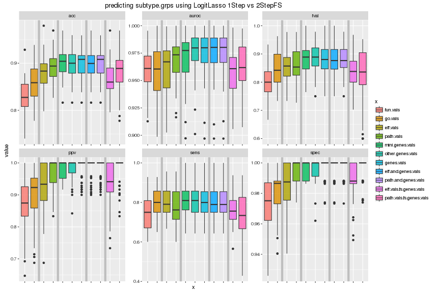
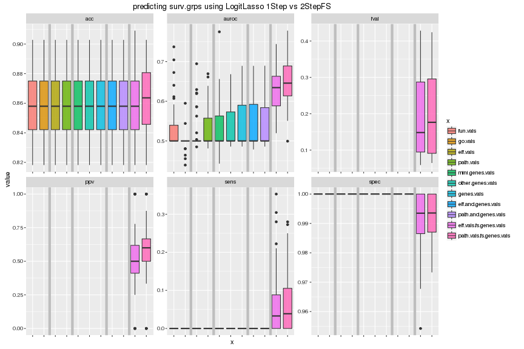
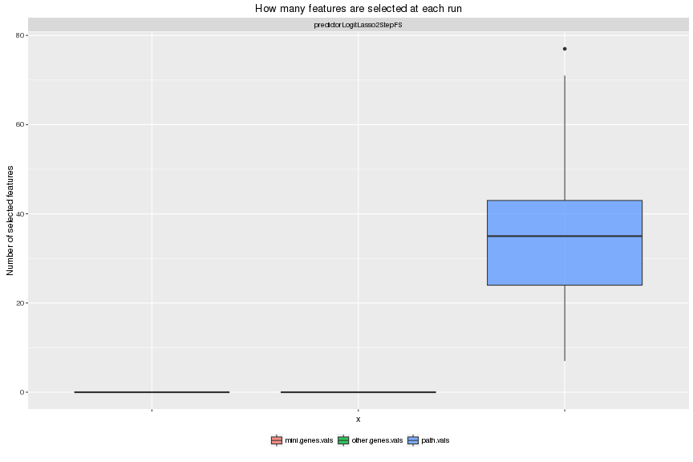
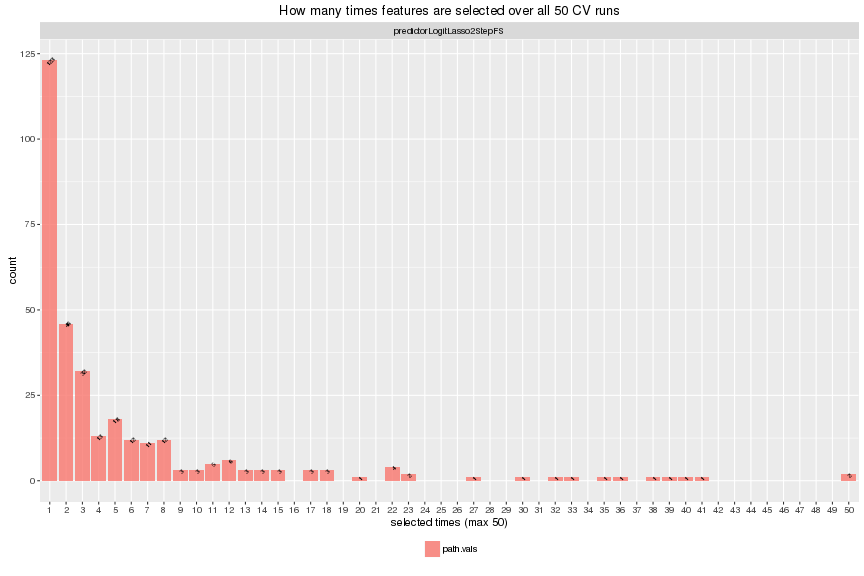
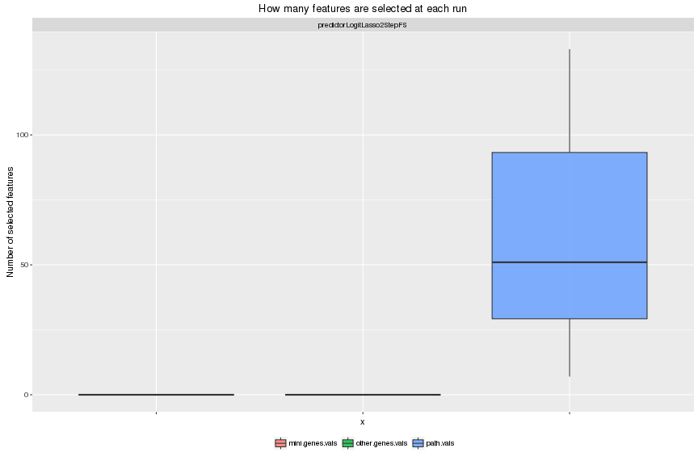
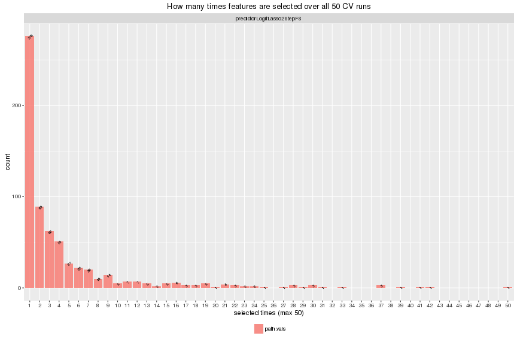

# Feature selection results
# Yunlong Jiao, 10 June 2016

This script studies the potential of improving prediction by adding to pre-selected pathways a list of genes that provide othogonal information. Specifically a predictor is built on pathways features to make prediction while automating feature selection; this set of pre-selected pathway features are combined with genes to make a second/final model where the pre-selected pathways are always included in model but genes are being selected to improve the prediction.


```r
knitr::opts_chunk$set(error = FALSE, fig.width = 12, fig.height = 8, dev = c("png","pdf"), fig.keep = "high", fig.path = "7_fsResults_figure/", cache.path = "7_fsResults_cache/")
set.seed(30430397)
source("../../src/func.R")
library(reshape2)
library(ggplot2)
```

First read in parameters!


```r
# load in workspace
load("dat.RData")
rm(list = ls(pattern="[.]kmat$"))
# read in parameters
param <- read.table("6_fsPredict.txt", header = FALSE, row.names = NULL, col.names = c("xname", "yname", "prname", "i.fold", "nfolds", "nrepeats", "i.fold.inn", "nfolds.inn", "nrepeats.inn"))
# features
xlist <- unique(param$xname)
xlist <- grep("eff|path", xlist, value = TRUE) # only retain pathway values
xlist <- c(xlist, # specific 2-step selected features
           unique(unlist(strsplit(xlist, "[.]fs[.]"))), # individual features
           gsub("vals[.]fs", "and", xlist), # "and"-type features
           "fun.vals", "go.vals", "mini.genes.vals", "other.genes.vals") # two more restricted set of gene-related vals
xlist
```

```
##  [1] "eff.vals.fs.genes.vals"  "path.vals.fs.genes.vals"
##  [3] "eff.vals"                "genes.vals"             
##  [5] "path.vals"               "eff.and.genes.vals"     
##  [7] "path.and.genes.vals"     "fun.vals"               
##  [9] "go.vals"                 "mini.genes.vals"        
## [11] "other.genes.vals"
```

```r
# feature types # to decide which prname to use and the following order is also fairly important for plotting
xlist.type <- c("func-wise", "func-wise", # prname == "predictorLogitLasso"
                "path-wise", "path-wise",  # prname == "predictorLogitLasso"
                "gene-wise", "gene-wise", "gene-wise",  # prname == "predictorLogitLasso"
                "mix-wise", "mix-wise",  # prname == "predictorLogitLasso"
                "fs-wise", "fs-wise") # prname == "predictorLogitLasso2StepFS"
names(xlist.type) <- c("fun.vals", "go.vals", # functionality features
                       "eff.vals", "path.vals", # pathway features
                       "mini.genes.vals", "other.genes.vals", "genes.vals", # gene features
                       "eff.and.genes.vals", "path.and.genes.vals", 
                       "eff.vals.fs.genes.vals", "path.vals.fs.genes.vals") # mixed type
xlist.vline <- c(2.5, 4.5, 7.5, 9.5) # cut out types
stopifnot(length(setdiff(xlist, names(xlist.type))) == 0)
xlist.type
```

```
##                fun.vals                 go.vals                eff.vals 
##             "func-wise"             "func-wise"             "path-wise" 
##               path.vals         mini.genes.vals        other.genes.vals 
##             "path-wise"             "gene-wise"             "gene-wise" 
##              genes.vals      eff.and.genes.vals     path.and.genes.vals 
##             "gene-wise"              "mix-wise"              "mix-wise" 
##  eff.vals.fs.genes.vals path.vals.fs.genes.vals 
##               "fs-wise"               "fs-wise"
```

```r
# groups
ylist <- unique(param$yname)
ylist
```

```
## [1] "subtype.grps" "surv.grps"
```

```r
# predictors
prlist <- unique(param$prname)
stopifnot(all(prlist == "predictorLogitLasso2StepFS"))
prlist
```

```
## [1] "predictorLogitLasso2StepFS"
```

```r
# (outter) `nfolds`-fold CV repeated `nrepeats` times for evaluation
nfolds <- unique(param$nfolds)
stopifnot(length(nfolds) == 1)
nfolds
```

```
## [1] 5
```

```r
nrepeats <- unique(param$nrepeats)
stopifnot(length(nrepeats) == 1)
nrepeats
```

```
## [1] 10
```

```r
# inner `nfolds.inn`-fold CV repeated `nrepeats.inn` times for tuning predictors
nfolds.inn <- unique(param$nfolds.inn)
stopifnot(length(nfolds.inn) == 1)
nfolds.inn
```

```
## [1] 5
```

```r
nrepeats.inn <- unique(param$nrepeats.inn)
stopifnot(length(nrepeats.inn) == 1)
nrepeats.inn
```

```
## [1] 1
```

```r
# evaluation measures
slist <- c("acc","fpr","tpr","ppv","fval", "auroc")
slist
```

```
## [1] "acc"   "fpr"   "tpr"   "ppv"   "fval"  "auroc"
```

```r
slist.prefer.large.score <- c(TRUE, FALSE, TRUE, TRUE, TRUE, TRUE)
names(slist.prefer.large.score) <- slist
slist.prefer.large.score
```

```
##   acc   fpr   tpr   ppv  fval auroc 
##  TRUE FALSE  TRUE  TRUE  TRUE  TRUE
```


## Performance with LogitLasso only

In this secion, we fix the predictor to be LogitLasso and compare model performances of different feature types wrt various criteria.


```r
scores <- list()
for (yname in ylist) {
  for (xname in xlist) {
    message(yname, '\t', xname)
    prname <- switch(xlist.type[xname],
                     "fs-wise" = "predictorLogitLasso2StepFS", 
                     "predictorLogitLasso")
    res.files <- list.files(path = 'Robj', 
                            pattern = paste('^ivres', xname, yname, prname, 
                                            '[[:digit:]]+', nfolds, nrepeats, 
                                            0, nfolds.inn, nrepeats.inn, 
                                            sep = '_'), 
                            full.names = TRUE)
    res <- lapply(res.files, function(f) get(load(f)))
    names(res) <- paste0("rep",1:length(res))
    # reduce to only scores and melt
    res <- lapply(res, '[', slist)
    res <- melt(res)
    colnames(res)[colnames(res) == "L1"] <- "rep"
    colnames(res)[colnames(res) == "L2"] <- "score"
    
    # record score values
    objname <- paste('res', xname, yname, prname, nfolds, nrepeats, sep = '_')
    scores[[objname]] <- data.frame(y = yname, 
                                    x = xname, 
                                    type = xlist.type[xname], 
                                    predictor = prname, 
                                    res, 
                                    row.names = NULL)
  }
}
scores <- do.call('rbind', scores)
rownames(scores) <- seq(nrow(scores))
head(scores)
```

```
##              y                      x    type                  predictor
## 1 subtype.grps eff.vals.fs.genes.vals fs-wise predictorLogitLasso2StepFS
## 2 subtype.grps eff.vals.fs.genes.vals fs-wise predictorLogitLasso2StepFS
## 3 subtype.grps eff.vals.fs.genes.vals fs-wise predictorLogitLasso2StepFS
## 4 subtype.grps eff.vals.fs.genes.vals fs-wise predictorLogitLasso2StepFS
## 5 subtype.grps eff.vals.fs.genes.vals fs-wise predictorLogitLasso2StepFS
## 6 subtype.grps eff.vals.fs.genes.vals fs-wise predictorLogitLasso2StepFS
##       value score  rep
## 1 0.8484848   acc rep1
## 2 0.0000000   fpr rep1
## 3 0.7000000   tpr rep1
## 4 1.0000000   ppv rep1
## 5 0.8235294  fval rep1
## 6 0.9689873 auroc rep1
```


```r
# plot each grps in a separate figure
for (yname in ylist) {
  d <- subset(scores, scores$y == yname)
  # order feature by types
  d$x <- factor(d$x, levels = names(xlist.type), ordered = TRUE)
  # change score values by "fpr" to that by "spec"
  d$value[d$score == "fpr"] <- 1 - d$value[d$score == "fpr"]
  d$score[d$score == "fpr"] <- "spec"
  # change score name "tpr" to "sens"
  d$score[d$score == "tpr"] <- "sens"
  p1 <- ggplot(d, aes(x = x, y = value)) + 
    geom_boxplot(aes(fill = x), alpha = 0.8) + 
    geom_vline(xintercept = xlist.vline, color = "grey", size = 2) + 
    facet_wrap(~score, scales = "free") + 
    ggtitle(paste0("predicting ", yname, " using LogitLasso 1Step vs 2StepFS")) + 
    theme(axis.text.x = element_blank())
  plot(p1)
}
```



```
## Warning: Removed 987 rows containing non-finite values (stat_boxplot).
```




## Feature selection

In this section, with the predictor built following a specific 2-step feature selection, we have found **genes that provide orthogonal information**, compensating (and improving) the prediction from pathway features for each `yname` in subtype.grps, surv.grps.

**NOTE if results are "weird", check 6_fsPredict.R and change penalty.factor.ratio or lam.pen.ratio manually so that lam.pen which is read from elsewhere is compatible with themodel trained under our new 2-step FS setting here!!**

**NOTE lambda tuning rules!! As we need to tune 2-dim regularization parameters, namely lam.nopen (step 1) and lam.pen (step 2), we follow the rules confining to 1) larger CV acc; 2) then less total number of features; 3) then more number of pathway features!!**


```r
xname <- "path.vals.fs.genes.vals" # do not alter
xname.list <- c("mini.genes.vals", "other.genes.vals", "path.vals") # do not alter
featlist.long <- lapply(xname.list, function(u){
  colnames(get(u))
})
names(featlist.long) <- xname.list
n.featlist.long <- sapply(featlist.long, length)

prname <- "predictorLogitLasso2StepFS"
# show each grp separately
for (yname in ylist) {
  message(yname, '\t', prname)
  res.files <- list.files(path = 'Robj', 
                          pattern = paste('^ivres', xname, yname, prname, 
                                          '[[:digit:]]+', nfolds, nrepeats, 
                                          0, nfolds.inn, nrepeats.inn, 
                                          sep = '_'), 
                          full.names = TRUE)
  res <- lapply(res.files, function(f) get(load(f)))
  names(res) <- paste0("rep",1:length(res))
  
  # featselect
  featlist.short <- lapply(res, '[[', 'featlist.short')
  featlist.short <- lapply(featlist.long, function(u){
    lapply(featlist.short, function(v){
      intersect(u,v)
    })
  })
  assign(paste(yname,prname,"featlist.short",sep="_"), featlist.short)
  rm(res)
}
```

For each `yname` in subtype.grps, surv.grps, we have several plots to illustrate the results
- Boxplot on the number of selected features from each feature type in mini.genes.vals, other.genes.vals, path.vals, wrt different algorithms, where variance shows at each CV run.
- Histogram of how many times one feature are selected in total over all 50 CV runs, specific to each type and each algorithm.


```r
# show each grp separately
for (yname in ylist) {
  cat('\n---> \t Specific 2-step feature selection \t <---\n')
  cat('\n---------> \t for ', yname, ' \t <---------\n')
  # featselect
  featlist.short <- lapply(prlist, function(prname){
    get(paste(yname,prname,"featlist.short",sep="_"))
  })
  names(featlist.short) <- prlist
  # featlist.short is 3-layer list prlist -> xname.list -> CV repeats -> a character vector of feature names
  # number of features are selected at each CV run
  featlist.freq <- lapply(featlist.short, function(u) lapply(u, lapply, length))
  featlist.freq <- melt(featlist.freq, level = 1, value.name = "value")
  colnames(featlist.freq)[colnames(featlist.freq)=="L1"] <- "prname"
  colnames(featlist.freq)[colnames(featlist.freq)=="L2"] <- "xname"
  colnames(featlist.freq)[colnames(featlist.freq)=="L3"] <- "rep"
  # proportion across group
  n.featlist.short <- tapply(featlist.freq$value, list(featlist.freq$rep, featlist.freq$prname), sum)
  cat('\nTotal number of features selected at each run (averaged over each CV run)\n')
  cat('(NOTE THAT GENES PROVIDE ORTHOGONAL INFO TO PATHWAYS)\n\n')
  print(colMeans(n.featlist.short))
  # proportion within group
  cat('\nTotal number of features within each type\n')
  cat('(NOTE THAT GENES PROVIDE ORTHOGONAL INFO TO PATHWAYS)\n\n')
  print(n.featlist.long)
  # plot
  p1 <- ggplot(featlist.freq, aes(x = xname, y = value)) + 
    geom_boxplot(aes(fill = xname), alpha = 0.8) + 
    facet_wrap(~prname, scales = "free") + 
    scale_x_discrete(name = "x") + 
    scale_y_continuous(name = "Number of selected features") + 
    ggtitle(paste0("How many features are selected at each run")) + 
    theme(axis.text.x = element_blank(), legend.title = element_blank(), legend.position = "bottom")
  plot(p1)
  
  # show top 10 most selected features in each type by predictor
  featlist.tab <- lapply(featlist.short, function(u) lapply(u, function(v) 
    sort(table(unlist(v)), decreasing = TRUE)
  ))
  cat('\nPreview of top 10 most often selected features in each type\n')
  cat('The value indicate this feature has been selected how many times out of all ', nrepeats*nfolds, ' CV runs\n')
  cat('(NOTE THAT GENES PROVIDE ORTHOGONAL INFO TO PATHWAYS)\n\n')
  print(lapply(featlist.tab, function(u) lapply(u, head, n=10)))
  
  # count number of times of features from each type being selected over CV runs
  featlist.count <- melt(featlist.tab, level = 1, value.name = "value")
  colnames(featlist.count)[colnames(featlist.count)=="L1"] <- "prname"
  colnames(featlist.count)[colnames(featlist.count)=="L2"] <- "xname"
  colnames(featlist.count)[colnames(featlist.count)=="Var1"] <- "featname"
  featlist.count <- dcast(featlist.count, prname+xname~value, fun.aggregate = length)
  featlist.count <- melt(featlist.count, id.vars = c("prname","xname"))
  featlist.count$variable <- factor(featlist.count$variable, levels = as.character(1:(nrepeats*nfolds)), ordered = TRUE)
  p1 <- ggplot(featlist.count, aes(x = variable, y = value)) + 
    geom_bar(aes(fill = xname), stat = "identity", position = "dodge", alpha = 0.8) + 
    geom_text(aes(label = value, group = xname), size = 2, angle = 45, colour = "black", position = position_dodge(0.9), vjust = 0.9) + 
    facet_wrap(~prname, scales = "free", ncol = 1) + 
    scale_x_discrete(name = paste0("selected times (max ", nfolds*nrepeats, ")"), drop = FALSE) + 
    scale_y_continuous(name = "count") + 
    ggtitle(paste0("How many times features are selected over all ", nfolds*nrepeats, " CV runs")) + 
    theme(legend.title = element_blank(), legend.position = "bottom")
  plot(p1)
}
```

```
## 
## ---> 	 Specific 2-step feature selection 	 <---
## 
## ---------> 	 for  subtype.grps  	 <---------
## 
## Total number of features selected at each run (averaged over each CV run)
## (NOTE THAT GENES PROVIDE ORTHOGONAL INFO TO PATHWAYS)
## 
## predictorLogitLasso2StepFS 
##                      34.36 
## 
## Total number of features within each type
## (NOTE THAT GENES PROVIDE ORTHOGONAL INFO TO PATHWAYS)
## 
##  mini.genes.vals other.genes.vals        path.vals 
##             2212            16496             6101
```



```
## 
## Preview of top 10 most often selected features in each type
## The value indicate this feature has been selected how many times out of all  50  CV runs
## (NOTE THAT GENES PROVIDE ORTHOGONAL INFO TO PATHWAYS)
## 
## $predictorLogitLasso2StepFS
## $predictorLogitLasso2StepFS$mini.genes.vals
## integer(0)
## 
## $predictorLogitLasso2StepFS$other.genes.vals
## integer(0)
## 
## $predictorLogitLasso2StepFS$path.vals
## 
##     X_hsa04520__22___4    X_hsa04919__33___39   X_hsa05200__27___200 
##                     50                     50                     41 
## X_hsa04012__11_12___65    X_hsa04520__22___18   X_hsa05200__39___198 
##                     40                     39                     38 
##    X_hsa05200__27___48    X_hsa05200__27___49    X_hsa04010__26___12 
##                     36                     35                     33 
##     X_hsa03320__1___63 
##                     32
```



```
## 
## ---> 	 Specific 2-step feature selection 	 <---
## 
## ---------> 	 for  surv.grps  	 <---------
## 
## Total number of features selected at each run (averaged over each CV run)
## (NOTE THAT GENES PROVIDE ORTHOGONAL INFO TO PATHWAYS)
## 
## predictorLogitLasso2StepFS 
##                      59.96 
## 
## Total number of features within each type
## (NOTE THAT GENES PROVIDE ORTHOGONAL INFO TO PATHWAYS)
## 
##  mini.genes.vals other.genes.vals        path.vals 
##             2212            16496             6101
```



```
## 
## Preview of top 10 most often selected features in each type
## The value indicate this feature has been selected how many times out of all  50  CV runs
## (NOTE THAT GENES PROVIDE ORTHOGONAL INFO TO PATHWAYS)
## 
## $predictorLogitLasso2StepFS
## $predictorLogitLasso2StepFS$mini.genes.vals
## integer(0)
## 
## $predictorLogitLasso2StepFS$other.genes.vals
## integer(0)
## 
## $predictorLogitLasso2StepFS$path.vals
## 
##    X_hsa04068__80___46 X_hsa04261__57___14_16 X_hsa04622__7___5_8_37 
##                     50                     42                     41 
##   X_hsa05200__13___196   X_hsa04020__9_53___7 X_hsa04261__58___14_16 
##                     39                     37                     37 
##    X_hsa04520__20___17 X_hsa04261__59___14_16    X_hsa04350__53___28 
##                     37                     33                     31 
## X_hsa04350__62___48_49 
##                     30
```




## Session info


```r
sessionInfo()
```

```
## R version 3.2.1 (2015-06-18)
## Platform: x86_64-unknown-linux-gnu (64-bit)
## 
## locale:
##  [1] LC_CTYPE=en_US.UTF-8       LC_NUMERIC=C              
##  [3] LC_TIME=en_US.UTF-8        LC_COLLATE=en_US.UTF-8    
##  [5] LC_MONETARY=en_US.UTF-8    LC_MESSAGES=en_US.UTF-8   
##  [7] LC_PAPER=en_US.UTF-8       LC_NAME=C                 
##  [9] LC_ADDRESS=C               LC_TELEPHONE=C            
## [11] LC_MEASUREMENT=en_US.UTF-8 LC_IDENTIFICATION=C       
## 
## attached base packages:
## [1] methods   stats     graphics  grDevices utils     datasets  base     
## 
## other attached packages:
## [1] ggplot2_2.1.0  reshape2_1.4.1
## 
## loaded via a namespace (and not attached):
##  [1] Rcpp_0.12.1      digest_0.6.8     grid_3.2.1       plyr_1.8.3      
##  [5] gtable_0.1.2     formatR_1.3      magrittr_1.5     evaluate_0.8.3  
##  [9] scales_0.3.0     stringi_1.0-1    labeling_0.3     tools_3.2.1     
## [13] stringr_1.0.0    munsell_0.4.2    colorspace_1.2-6 knitr_1.12.3
```
